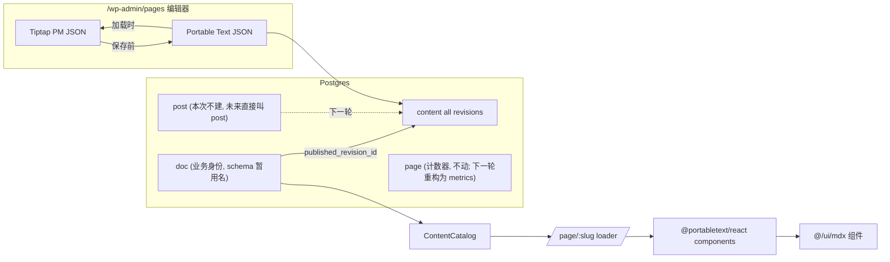

# Page 迁移到 Postgres + PortableText/Tiptap 编辑器（修订版：三表模型）

## 一、整体策略与边界决定（已确认）

- **存储格式**：PortableText（数组式 JSONB），与 Sanity 生态对齐。编辑器内部用 Tiptap，保存前 PT↔PM 双向转换。
- **数据模型（修订）**：三张表分工清晰。命名上严格分两层 —— 物理名（仅 schema.ts 可见）与业务名（其它所有代码使用）。

| 角色 | DB 物理名 | Drizzle 导出符号 | 业务代码 import 别名 | TS DTO 类型 |
| --- | --- | --- | --- | --- |
| 新业务身份表（page 元数据 + revision 指针） | `doc` | `docTable` | `pageMetaTable` | `PageMetaRow` |
| 现有计数器表（PV / vote / 等） | `page` | `pageTable` | `metricTable` | `MetricRow` |
| revision 仓库（page/post 共用） | `content` | `contentTable` | （同名） | `ContentRow` |
| 下一轮 Post 业务身份表（本轮不建） | `post` | `postTable` | `postMetaTable` | `PostMetaRow` |

  - **业务身份表**：物理名暂为 `doc`，业务全用 `pageMetaTable` / `Page` / `PageMeta`。`doc` 这个词**仅出现在 schema.ts** 的 `pgTable('doc', ...)` 与 `export const docTable = ...` 两处，业务代码不得使用。
  - **`content`**：存 page/post 共用的所有 revision，含 `type` 列。
  - **现有计数器表**：物理名 `page` 不变（避免 SQL migration 与 like/comment 表的 `page_key` FK 改造），但**业务命名全量改为 metric**：`src/server/db/query/page.ts` 重命名为 `metric.ts`；所有符号 `pageKey → metricKey`、`upsertPage → upsertMetric`、`pageMetricsByKeys → metricsByKeys`、`pageVoteUp → metricVoteUp`、`generatePageKey → generateMetricKey` 等等。涉及 server / shared / UI / routes / tests 共约 50+ 文件、200+ 处，本轮 PR 一次性改完。
  - **下一轮 Post 业务身份表会直接叫 `post`**（不叫 `post_meta`/`cms_post`），本次不创建，但 `content.type` 列预留 `'post'` 值，下一轮 Post 迁移直接加 `post` 表 + `toPost()` 投影即可。
  - **未来收回正名**（下一轮 PR）：先 `ALTER TABLE page RENAME TO metrics`（顺便去掉 `key` 列改用 `(type, owner_id)` 复合键），再 `ALTER TABLE doc RENAME TO page`，schema.ts 改两个字面量 + 改两处 `pgTable(...)` 名，业务代码 0 改动（因为本轮就把别名规则定死）。
- **编辑器内核**：Tiptap (`@tiptap/react` + StarterKit + 必需 extensions)。允许新增 headless 依赖：`@dnd-kit/core` + `@dnd-kit/sortable`（如需）、`@floating-ui/react`（已装）。**禁止** Phosphor / Kumo / Lingui，所有 UI 一律 shadcn/ui + lucide-react + Tailwind。
- **公开 SSR 渲染**：`@portabletext/react` 的 `<PortableText components={...}/>`，自定义 type/mark 复用现有 `@/ui/mdx/*` 组件（`MdxImg`、`MusicPlayer`、`Solution`、`Friends`、`CodeBlock`、`Footnotes`），让公开样式与 MDX 时代逐字节一致（`prose-blog prose post-content` 不变）。
- **本次范围**：仅 Page（about/links/guestbook）。Post 暂不动；本次必须把 Post 也会用到的所有自定义节点全部建好（math/mermaid/footnote/solution/musicplayer/friends），让 Post 迁移变成 “灌数据 + 写 toPost()”。



## 二、数据层

### 2.1 表结构

在 [src/server/db/schema.ts](src/server/db/schema.ts) 末尾追加。**现有 `page` 表（评论计数器）不动。**

> **命名约定（重要）**：本轮 plan 出现的 `doc` 仅是 DB schema 层的物理表名 + Drizzle pgTable 标识符，是因为现有 `page` 表（计数器）暂时占用 `page` 这个名字。所有 TS 类型、service、route、API_ACTION、UI 命名都使用 Page / PageMeta / PageEditor 等业务语义；`doc` 这个词不应该泄漏到 schema.ts 之外。下一轮把现有 `page` 表瘦身重命名为 `metrics` 后，会一条 `ALTER TABLE doc RENAME TO page;` 收回正名，业务代码 0 改动。

#### `content`（page/post 共用，所有 revision）

```ts
export const content = pgTable(
  'content',
  {
    id: bigserial('id', { mode: 'bigint' }).primaryKey().notNull(),
    createdAt: timestamp('created_at', { withTimezone: true, mode: 'date' })
      .notNull()
      .$defaultFn(() => new Date()),
    updatedAt: timestamp('updated_at', { withTimezone: true, mode: 'date' })
      .notNull()
      .$defaultFn(() => new Date()),
    /** 'page' | 'post'；本次只写 'page'，'post' 留位。 */
    type: varchar('type', { length: 16 }).notNull(),
    /** 业务侧指向 doc.id（type='page'，未来 ALTER 改回 page.id）或 post.id（type='post'，下一轮）；application-level 关联，不加 FK，避免下一轮表改名时反向锁住 content。 */
    ownerId: bigint('owner_id', { mode: 'bigint' }).notNull(),
    /** 同一 owner 内自增。INSERT 时 SELECT MAX+1（同事务串行化）。 */
    revisionNo: integer('revision_no').notNull(),
    /** 'draft' | 'published'。published 后不可再写（service 层强制）。 */
    status: varchar('status', { length: 16 }).notNull().default('draft'),
    /** PortableText 数组。 */
    body: jsonb('body').notNull().default(sql`'[]'::jsonb`),
    /** 内容里所有图片 URL 的快照，用于 thumbhash 预解析。 */
    imageSources: jsonb('image_sources').notNull().default(sql`'[]'::jsonb`),
    /** 编辑器侧算好的 TOC，避免 SSR 现遍历 PT。 */
    headings: jsonb('headings').notNull().default(sql`'[]'::jsonb`),
    authorId: bigint('author_id', { mode: 'bigint' }),
  },
  (t) => [
    uniqueIndex('uq_content_owner_revision').on(t.type, t.ownerId, t.revisionNo),
    index('idx_content_owner_latest').on(t.type, t.ownerId, t.revisionNo.desc()),
    index('idx_content_status').on(t.status),
  ],
)
```

> **关键不变量（service 层强制）**：
> 1. `status='published'` 的行不可被 UPDATE（除 `updated_at`、`deleted_at` 外）。
> 2. 同一 `(type, owner_id)` 的 `revision_no` 严格递增、连续。
> 3. 不做硬删（避免 `doc.published_revision_id` 悬空）。

#### `doc`（page 业务身份表，schema 层暂用名；TS 命名 Page）

> 业务命名重申：service.ts 文件名为 `page-meta/service.ts`、DTO 类型为 `PageMetaRow`、API action 为 `admin.upsertPageMeta` 等等。Drizzle 这里的 `pgTable('doc', ...)` 是**唯一**出现 `doc` 字面量的地方。

```ts
// Drizzle 标识符暂用 docTable 以与"业务 Page"区分；schema 之外的代码引用此符号时
// 通过 import { docTable as pageMetaTable } from '@/server/db/schema' 用业务别名。
export const docTable = pgTable(
  'doc',
  {
    id: bigserial('id', { mode: 'bigint' }).primaryKey().notNull(),
    createdAt: timestamp(...).notNull().$defaultFn(...),
    updatedAt: timestamp(...).notNull().$defaultFn(...),
    deletedAt: timestamp(...),
    slug: varchar('slug', { length: 80 }).unique().notNull(),
    title: varchar('title', { length: 200 }).notNull(),
    summary: text('summary').notNull().default(''),
    cover: text('cover').notNull().default(''),
    og: text('og'),
    /** page_meta.published 控制“是否在公开站显示”（route + listing），与 content.status 解耦。 */
    published: boolean('published').notNull().default(true),
    commentsEnabled: boolean('comments_enabled').notNull().default(true),
    showToc: boolean('show_toc').notNull().default(false),
    /** 首次发布日期，用于公开页“写于 yyyy-MM-dd”。后续发布只更 content.created_at（用作 “updated” 字段）。 */
    publishedAt: timestamp('published_at', { withTimezone: true }).notNull(),
    /** 当前公开版本指针。NULL = 还没发布过（草稿态新页面）。published 行删不掉，所以指针永远有效或 NULL。 */
    publishedRevisionId: bigint('published_revision_id', { mode: 'bigint' }),
  },
  (t) => [index('idx_page_meta_slug').on(t.slug), index('idx_page_meta_deleted_at').on(t.deletedAt)],
)
```

> 不加 `published_revision_id` 的 FK，因为 content 是 application-level 关联表（owner_id 也不是 FK，对称）；service 层做完整性检查。

#### `post`（本次不建表、不出 migration）

未来的 post 业务身份表**直接叫 `post`**（不叫 `post_meta` 或 `cms_post`，与未来 `doc → page` 收回正名后的对称形态一致）。本轮仅在 [src/server/db/schema.ts](src/server/db/schema.ts) 留 TS 注释占位 + 一份 markdown 设计草稿到 [src/server/cms/POST-DRAFT.md](src/server/cms/POST-DRAFT.md)，避免 schema 文件提早膨胀。

### 2.2 通用 → 实体投影

新文件 [src/server/cms/content-projection.ts](src/server/cms/content-projection.ts)，纯函数：

```ts
// content + doc 行 -> Page DTO（与 @/server/catalog/schema.ts 的 Page 型一致）
export function toPage(meta: PageMetaRow, revision: ContentRow): Page { ... }

// 为 Post 预留（本次不实现，仅签名 + throw "not implemented yet"）
export function toPost(meta: unknown, revision: ContentRow): never { ... }
```

`toPage` 负责：
- 校验 `revision.type === 'page' && revision.ownerId === meta.id`，失败 → throw（catalog 装载时炸响）。
- 把 `meta.publishedAt` 投影成 `Page.date`，把 `revision.createdAt` 投影成 `Page.updated`（与现 MDX 行为一致）。
- 把 `revision.body` 原样放到 `Page.body`（PortableText 数组），`headings` 也原样接。
- `mdxPath` 字段保留为空字符串（不破坏 `Page` 接口现有消费者）。

### 2.3 Service 与状态机

> 服务层全部用业务命名 `PageMeta` / `pageMeta` / `Page` 等，绝不出现 `doc`。从 schema.ts 引入时一律 `import { docTable as pageMetaTable } from '@/server/db/schema'`，让 query 代码读起来是"对 page_meta 表操作"。

新增 [src/server/cms/page-meta/service.ts](src/server/cms/page-meta/service.ts)：`listAdminPageMetas`、`getAdminPageMetaById`、`getAdminPageMetaBySlug`、`upsertPageMeta`、`softDelete`、`restore`、`listPublicPageMetas`。

新增 [src/server/cms/content/service.ts](src/server/cms/content/service.ts)，含 **保存/发布状态机**（事务执行）：

```ts
// 加载编辑器初始内容：取最新 revision（无论 draft/published），无则返回空骨架。
async function getLatestRevisionForEditor(type, ownerId): ContentRow | null

// "保存" —— 草稿覆盖 OR 新建草稿
async function saveDraftRevision(input: { type, ownerId, body, imageSources, headings, authorId }):
  Promise<{ revision: ContentRow; created: boolean }> {
  return tx(async (tx) => {
    const latest = await tx.select().from(content)
      .where(and(eq(content.type, type), eq(content.ownerId, ownerId)))
      .orderBy(desc(content.revisionNo)).limit(1).for('update')

    if (latest && latest.status === 'draft') {
      // 在草稿上覆盖（保留 revisionNo / createdAt，更 updated_at）。
      await tx.update(content).set({ body, imageSources, headings, authorId, updatedAt: new Date() })
        .where(eq(content.id, latest.id))
      return { revision: <reload>, created: false }
    }
    // 没有最新行 OR 最新行已发布 -> 开新草稿
    const nextNo = (latest?.revisionNo ?? 0) + 1
    const inserted = await tx.insert(content).values({ type, ownerId, revisionNo: nextNo, status: 'draft', body, imageSources, headings, authorId }).returning()
    return { revision: inserted[0], created: true }
  })
}

// "发布" —— 一站式：保存当前编辑器内容 + 标记 published + 指针更新（单事务）
//
// 入参语义：调用方（前端 publish 按钮）直接传当前编辑器的 body / imageSources /
// headings —— 不要求前端先自己点保存。后端在事务里：
//   1) 走 saveDraftRevision 同款逻辑（内联，复用同一事务）：
//      - 最新行是 draft  → 覆盖该行的 body/imageSources/headings/updated_at；revisionId 仍是该行
//      - 最新行是 published / 无最新行 → INSERT 一行新 draft
//      （注意：如果前端就是想"重发布当前最新 published 不带任何编辑改动"，body 与
//       已发布行字段相等会照样新建一行；这是显式语义，避免做 deep-equal 比较的隐式短路。
//       前端 UI 要在 published-current 状态下把 publish 按钮置灰，避免误触。）
//   2) UPDATE content SET status='published' WHERE id=$revisionId AND status='draft'
//      0 行返回 → 已被并发抢发布，throw Conflict。
//   3) UPDATE page_meta SET published_revision_id=$revisionId
//   4) 返回最新 page_meta + 该 revision 行
async function publishLatest(input: {
  type: 'page', ownerId, body, imageSources, headings, authorId
}): Promise<{ pageMeta: PageMetaRow; revision: ContentRow }> {
  return tx(async (tx) => {
    // —— 第 1 步：内联 saveDraftRevision（不再独立调一次以避免事务嵌套与
    //    第二次 SELECT FOR UPDATE 的额外行锁。）
    const latest = await tx.select().from(content)
      .where(and(eq(content.type, type), eq(content.ownerId, ownerId)))
      .orderBy(desc(content.revisionNo)).limit(1).for('update')

    let revisionId: bigint
    if (latest && latest.status === 'draft') {
      await tx.update(content)
        .set({ body, imageSources, headings, authorId, updatedAt: new Date() })
        .where(and(eq(content.id, latest.id), eq(content.status, 'draft'))) // 守卫
      revisionId = latest.id
    } else {
      const nextNo = (latest?.revisionNo ?? 0) + 1
      const [inserted] = await tx.insert(content)
        .values({ type, ownerId, revisionNo: nextNo, status: 'draft', body, imageSources, headings, authorId })
        .returning({ id: content.id })
      revisionId = inserted.id
    }

    // —— 第 2 步：标记 published（带 status 守卫，已发布抢断 → 0 行）
    const updated = await tx.update(content)
      .set({ status: 'published', updatedAt: new Date() })
      .where(and(eq(content.id, revisionId), eq(content.status, 'draft')))
      .returning({ id: content.id })
    if (updated.length === 0) throw new Conflict('该版本已被其他端发布或不可发布')

    // —— 第 3 步：指针更新
    await tx.update(pageMetaTable)
      .set({ publishedRevisionId: revisionId, updatedAt: new Date() })
      .where(eq(pageMetaTable.id, ownerId))

    return { pageMeta: <reload>, revision: <reload> }
  })
}

// "查看历史"
async function listRevisions(type, ownerId, options: { limit, offset }): { rows, total }
```

> 服务层在所有变更点上额外做 “published 行禁写” 守卫：`UPDATE content SET ... WHERE id = $1 AND status <> 'published'`，0 行返回 → throw `Conflict`。即使有人绕过外层检查，DB 层也兜底。

### 2.4 saveDraft 的乐观并发标识

为了配合"两个浏览器轮流编辑同一篇 page"的场景，`content` 行加一个 `client_revision_token`（uuid）字段：

```ts
clientRevisionToken: uuid('client_revision_token').notNull().$defaultFn(() => randomUUID()),
```

每次 `saveDraft` UPDATE 草稿行时，`SET ..., client_revision_token = newToken WHERE id=$id AND status='draft' AND client_revision_token=$expected`。前端缓存上次返回的 token，下一次保存带上去做 CAS：
- 0 行返回 → 服务端 draft 被另一端改过，前端进入 §5.6 的 LS-vs-server diff 解决流程。
- 1 行返回 → 用新 token 覆盖前端缓存。

INSERT 新 draft 时 token 由后端默认值生成；前端拿到响应后接入。

### 2.5 imageSources 提取

[src/server/cms/content/image-sources.ts](src/server/cms/content/image-sources.ts)：纯函数 `extractImageSources(blocks)`，遍历 PortableText 收集所有 `image._type` 的 `asset.url` + 内嵌 `block.children` 中 `image` mark（暂无）。返回去重 URL 列表，写到 `content.image_sources` JSONB；`ContentCatalog` 拿来调 `resolveImageMetaBySources()` 取 thumbhash。

## 三、Catalog 与公开路由对接

[src/server/catalog/catalog.ts](src/server/catalog/catalog.ts) 改造：

- 删 `pageEntries` 来自 `#source/server` 的引用；改为（业务变量名 `pageMetas` 等保持不变；底层 SQL 命中 `doc` 物理表，但调用方无感）：
  ```ts
  const pageMetas = await listPublicPageMetas() // published=true && deletedAt=null
  const revisionIds = pageMetas.map(m => m.publishedRevisionId).filter(notNull)
  const revisions = await fetchContentByIds(revisionIds)
  const revisionsById = new Map(revisions.map(r => [r.id, r]))
  const pages = pageMetas
    .map(meta => meta.publishedRevisionId === null ? null : toPage(meta, revisionsById.get(meta.publishedRevisionId)!))
    .filter(notNull)
  ```
- `Page` 类型保留不动；`buildPage`(SourcePage) 函数删除，改为复用 `toPage`。
- `validatePageSlugs` / `hydrateImages(pages, 'cover', ...)` 不变。

[src/routes/page.detail.tsx](src/routes/page.detail.tsx) 改造：
- 不再 `preloadPageBody(sourcePage.mdxPath)`；loader 直接把 `sourcePage.body`（PortableText 数组）放到返回值。
- `<PageBody>` 渲染换为新的 `<PortableTextBody blocks={page.body} friends={friends} imageMeta={imageMeta} />`，路径 `@/ui/portable-text/PortableTextBody.tsx`。

[src/ui/portable-text/PortableTextBody.tsx]（新文件）：

- 用 `<PortableText value={blocks} components={portableTextComponents(friends, imageMeta)} />`。
- `portableTextComponents` 是 memo 工厂（与现 `pageComponentsCache` 同思路），把以下组件挂上：
  - `types.image` → `<MdxImg src alt width height data-thumbhash />`
  - `types.code` → `<CodeBlock>`，shiki 在 SSR 时同步 `await highlighter.codeToHtml(...)`（已有 `getHighlighter()` 全局缓存）。生成 HTML 后 `dangerouslySetInnerHTML` 注入。
  - `types['math-block']` → `<MathBlock svg />`，svg 由 `renderTexToSvg(tex, 'block')` 生成（从 [src/server/markdown/rehype-mathjax.ts](src/server/markdown/rehype-mathjax.ts) 抽出纯函数）。
  - `types.mermaid` → 复用 [src/server/markdown/mermaid/render.ts](src/server/markdown/mermaid/render.ts) 已有渲染器。
  - `types['music-player']` → `<MusicPlayer id />`
  - `types['friends-grid']` → `<Friends friends={friends} />`
  - `types.solution` → `<Solution><PortableText value={block.blocks} ... /></Solution>`（递归）
  - `marks['math-inline']` → 行内 SVG
  - `marks.link` → `<a href target rel>`
  - `marks['footnote-ref']` + `types['footnote-def']` → 复用 `<FootnoteReference>`/`<FootnoteDefinition>`，由 `<FootnoteProvider>` 包裹

- `PortableTextBody` 用 `React.cache()` 包住 `renderTexToSvg` / shiki 调用，让同 SSR 周期内同公式/同代码块只算一次。

`source.config.ts`：删除 `pages` collection；删除 `src/content/pages/`（保留 git 历史足以回滚）。

## 四、后台路由与 API

### 4.1 路由

`src/routes.ts` 在 wp-admin shell 里加：

```ts
route('wp-admin/pages', 'routes/wp-admin.pages.tsx'),
route('wp-admin/pages/new', 'routes/wp-admin.pages.edit.tsx', { id: 'wp-admin-pages-new' }),
route('wp-admin/pages/:id', 'routes/wp-admin.pages.edit.tsx'),
```

`AdminShell` nav 新增 `{ to: '/wp-admin/pages', label: '页面管理', icon: FileTextIcon }`，放在“音乐管理”上方。

### 4.2 内部 API

[src/shared/api-actions.ts](src/shared/api-actions.ts) `admin` 域追加：
- `listPages` (GET)：返 page_meta 列表 + 当前 published revision 摘要
- `getPage` (POST)：拉某个 page_meta + 编辑器初始 revision（最新 draft 或 latest published）
- `upsertPageMeta` (POST)：建/改 page_meta（不动 body）
- `saveDraft` (POST)：调 `saveDraftRevision`，body 是 PortableText 数组。请求体含可选 `expectedClientRevisionToken`（CAS 标识，§2.4）与可选 `force: boolean`（用户在 diff 选"用本地"时传 true，绕过 CAS 但记审计日志）。响应返新的 `clientRevisionToken`。
- `publishLatest` (POST)：一站式发布。前端传当前编辑器 body/imageSources/headings；后端在单事务里走 `publishLatest`（内联保存 + 标记 + 指针）。**前端不要先调 saveDraft 再调 publish**，会造成两次行锁与潜在并发。
- `listPageRevisions` (GET)：分页历史
- `deletePage` (DELETE) / `restorePage` (POST)：page_meta 软删/恢复
- `previewPage` (POST)：服务端渲染 PortableText 返回 HTML 片段（编辑器右栏预览）

对应资源路由 `src/routes/api/actions/admin.{listPages,getPage,upsertPageMeta,saveDraft,publishRevision,listPageRevisions,deletePage,restorePage,previewPage}.ts`，按现有 `admin.upsertCategory.ts` / `admin.upsertFriend.ts` 模板。**`saveDraft` 与 `previewPage`** 体积可能大，在 `runApi` 之前显式 `if (request.headers.get('content-length') > 1_000_000) throw 413`。

图片插入复用 `API_ACTIONS.admin.uploadImage`；音乐插入复用 `admin.listMusic` + `searchMusic` + `addMusic`。

## 五、编辑器（重头戏）

目录：

```
src/ui/admin/pages/
  PagesView.tsx               列表页
  usePagesController.ts       仿 useFriendsController
  PageEditor.tsx              编辑器主页（loader 数据 → 编辑器）
  PageMetadataPanel.tsx       右栏元数据
  PageEditorToolbar.tsx       顶部工具栏：保存 / 发布 / 切换预览 / 查看历史
  RevisionDrawer.tsx          历史 revision 抽屉（只读查看，二期再做 restore）
  ImageLibraryDialog.tsx
  MusicPickerDialog.tsx
src/ui/admin/pages/editor/
  TiptapPageEditor.tsx
  extensions/
    image-block.ts
    music-player-block.ts
    solution-block.ts
    math-inline.ts
    math-block.ts
    mermaid-block.ts
    friends-grid-block.ts
    footnote-ref.ts
    footnote-def.ts
    code-block.ts
    index.ts
  pt-bridge.ts                pmToPortableText / portableTextToPM
  slash-menu.ts
```

### 5.1 编辑器布局

`PageEditor.tsx` 整体两栏 grid：

- 左 `flex-1 min-w-0`：`<TiptapPageEditor>`，顶部 `<PageEditorToolbar>` sticky。
- 右 `w-96 shrink-0`：默认 `<PageMetadataPanel>`；toolbar 上 `<Tabs>` 切到 “预览”，则换 `<PageLivePreview html={html} />`（HTML 串来自 `previewPage` 资源路由，debounce 500ms）。
- 双栏切换不卸载左侧编辑器（`display: none` 隐藏）。

### 5.2 工具栏与三种状态机

`PageEditorToolbar` 上有：
- **保存**按钮：调 `admin.saveDraft`，按 §2.3 状态机决定是覆盖还是建新。返回值更新 `latestRevision` 引用。键位 Cmd/Ctrl+S。
- **发布**按钮：调 `admin.publishLatest`，**直接把当前编辑器全量 body/imageSources/headings 一并提交**——不需要也不应该先点保存。后端在单事务里完成"保存 → 标记 published → 指针更新"。前端拿到响应后把 `latestRevision` 与 `publishedRevisionId` 同步到内存状态。键位 Cmd/Ctrl+Shift+P。
  - 状态徽章为 `published-current`（最新行就是已发布，且 dirty=false）时按钮置灰，提示"无新内容可发布"——避免造一个内容相同的新 published revision。
  - dirty=true 时无论状态如何均可点（保存语义本身被发布动作吸收）。
- **预览** Tabs。
- **历史**按钮：打开 `RevisionDrawer`。

editor 顶端有一个状态徽章：
- `published-current`：最新一行就是已发布版本，保存会创建新草稿。
- `draft-ahead`：有 draft 在 published 之后，等待发布。
- `not-published-yet`：从未发布过（新建页面常态）。

### 5.3 PT ↔ PM 转换器（pt-bridge.ts）

仿 emdash `InlinePortableTextEditor.tsx` 的 `pmToPortableText` / `portableTextToPM` 骨架，扩展点：
- 新增 case：`musicPlayerBlock` / `solutionBlock` / `mathBlock` / `mermaidBlock` / `friendsGridBlock` / `footnoteDefNode` + mark：`mathInlineMark` / `footnoteRefMark`。
- 每种自定义节点保留 `_key` 稳定（`stableKey()`：用 `nanoid(9)`，从 attrs 读，没有就生成），保存时不重新分配，避免每次保存 diff 噪声。
- 完整 round-trip 契约：`pt -> pm -> pt` 必须深等。新增 `tests/contract.portable-text.test.ts`。

### 5.4 关键 Tiptap Extension 实现要点

- **image-block**：`atom: true`、`group: 'block'`、`draggable: true`。`addNodeView` 用 `ReactNodeViewRenderer`，缩略图 + 编辑 alt/caption + 点击打开 `ImageLibraryDialog`。
- **music-player-block**：`atom: true`，编辑器内直接 `<MusicPlayer id={node.attrs.playerId} />`，点击打开 `MusicPickerDialog`。
- **math-inline**：`Mark.create`，bubble 弹窗 textarea 直接编辑 tex。
- **math-block / mermaid-block**：`atom: true`，NodeView 是 textarea + 客户端预览（math 用 katex，mermaid 用 mermaid 客户端包）。预览渲染与 SSR 渲染走不同栈，已通过 §5.1 的 `previewPage` 资源路由消除差异。
- **solution-block**：`group: 'block'`、`content: 'block+'`、`defining: true`，NodeView `NodeViewContent` 让里面继续是 Tiptap 子文档。
- **footnote-ref / footnote-def**：ref 是 inline mark；def 是 block，编辑器自动收集到正文末。保存时按出现顺序重新编号。
- **code-block**：扩 StarterKit codeBlock，attrs 加 `language`；NodeView 在 `<pre>` 上方挂 shadcn `<Select>`。
- **friends-grid-block**：纯静态占位，NodeView 显示一句"友链网格（自动渲染）"。

### 5.5 Slash menu / Bubble menu / 拖拽

- Slash：仿 emdash `createSlashCommandsExtension`（`@tiptap/suggestion`），UI 用 shadcn `Command` + `Popover`。命令覆盖：H1/H2/H3、列表、引用、代码块、分割线、图片、音乐、公式、Mermaid、Solution、Friends 网格、脚注。
- Bubble menu：`@tiptap/react/menus` 的 `BubbleMenu`，按钮用 shadcn `Toggle` + lucide icon（Bold/Italic/Underline/Strike/Code/Link/Sup/Sub）。
- 拖拽重排：MVP 先用 Tiptap 自带 `draggable: true` + `dropcursor`，不引 dnd-kit。

### 5.6 自动保存 + Local Storage 兜底 + 冲突 diff

文件：

```
src/client/cms/
  use-page-draft-storage.ts     LocalStorage 读写 + 版本号 + 跨 tab BroadcastChannel
  use-page-autosave.ts          debounce 节流 + visibility/beforeunload 强制 flush
src/ui/admin/pages/editor/
  DraftConflictDialog.tsx       打开页面时显示的 diff 选边对话框
  PortableTextDiff.tsx          块级别 PortableText diff 渲染（Server vs Local）
```

#### Local Storage schema

key：`yufan:cms:page-draft:<pageMetaId>`（新建模式 pageMetaId 还没有，用临时 `new:<sessionLocalId>`，page 创建后迁移到正式 key）。

value：

```ts
{
  schemaVersion: 1,                     // 升级 PT dialect 时 bump
  pageMetaId: number | 'new',
  body: PortableTextBlock[],
  imageSources: string[],
  headings: MarkdownHeading[],
  metaSnapshot: { title, slug, summary, cover, og, published, commentsEnabled, showToc, publishedAt },
  /** 上次成功 saveDraft 时服务端返回的 token；用于打开页面时判断"本地草稿是基于哪个服务端版本的派生"。 */
  baseClientRevisionToken: string | null,
  /** 本地最后改动时间（编辑器 onUpdate 触发）。 */
  localUpdatedAt: number,                // ms epoch
  /** 上次成功 saveDraft 的时间，用于 UI 区分"未上传的 N 秒"。 */
  lastServerSavedAt: number | null,
}
```

`use-page-draft-storage.ts` 暴露 `loadLocalDraft(id)` / `saveLocalDraft(id, body, ...)` / `clearLocalDraft(id)` / `subscribeAcrossTabs(id, fn)` 四个 API；跨 tab 用 `BroadcastChannel` + `storage` 事件双重订阅，避免一边写一边另一边没收到。**写入用 `requestIdleCallback` 包一层，避免阻塞输入。**

#### 自动保存节奏（已确认 debounce-only）

`use-page-autosave.ts` 包装：

- **服务端写入触发条件**：`saveDraft` 在 onUpdate 后 debounce 5s；如果距上次成功 saveDraft 已超过 60s（hard cap），强制立即 flush，避免长时间连续输入永远不上传。
- **Local Storage 写入触发条件**：onUpdate 后 debounce 200ms（保护输入卡顿，不动主线程渲染）。
- **强制 flush 时机**：`document.visibilitychange === 'hidden'`、`beforeunload`、用户主动点"保存"按钮、用户切到"预览"tab、点"发布"按钮（此时是 publishLatest 自带保存语义，本地保存后 LS 由后端响应清空）。
- 保存成功后：`baseClientRevisionToken` 与 `lastServerSavedAt` 同步到 LS；toolbar 状态徽章显示"已保存于 hh:mm:ss"。
- 保存失败（非 409）：失败重试三次（指数退避 1s/3s/9s），仍失败则 toolbar 红字提示"自动保存失败：网络错误，本地内容已保留"——LS 在，用户可关页再开。
- 保存收到 409（CAS 失败，§2.4）：直接进入 §5.6 末"运行时冲突"分支，弹 `DraftConflictDialog`。

#### 打开编辑页时的冲突检测

`PageEditor` loader 服务端返：`{ pageMeta, latestRevision /* 可能是 published 也可能是 draft */, baseClientRevisionTokenOnServer }`。

客户端在 mount 时同步执行：

```ts
const local = loadLocalDraft(pageMeta.id)
if (!local) {
  // 没本地草稿 → 直接用服务端 latestRevision 灌入编辑器，正常开工
} else if (local.baseClientRevisionToken === serverLatestDraftToken) {
  // 本地草稿是当前服务端 draft 的派生（本人自己之前未保存的 keystroke）→ 静默使用本地，
  // 不打扰用户；toolbar 显示一条提示"已恢复本地未保存内容"，3s 后自动消失
} else {
  // 服务端 draft 已被另一端推进 → 本地与服务端各自基于不同 base，弹 DraftConflictDialog
}
```

#### `DraftConflictDialog`

shadcn `<Dialog>`，**不是** Alert——必须强制用户选边才能进入编辑器（避免用户没意识到就开始改丢内容）。

布局（仿 GitHub 的"Compare changes"页）：

- 顶部：左标题 `本地草稿 (修改于 yyyy-MM-dd hh:mm:ss)`，右标题 `服务端最新 (作者 X，于 yyyy-MM-dd hh:mm:ss)`。
- 主区：`<PortableTextDiff left={local.body} right={server.body} />`。
- 底部：两个按钮 `使用本地继续编辑` / `使用服务端继续编辑`。
- 第三个隐藏入口：`下载本地为 JSON`（防选错的逃生口）。

#### `PortableTextDiff` 渲染

PortableText 是数组，先按顺序匹配 `_key` 做最长公共子序列：

- 共同 \_key 且 body 深 equal → "未变" 行（折叠灰显）。
- 共同 \_key 但 body 不等 → "修改" 行（同一行左红右绿，文本块用字符级 `diff-match-patch` 高亮，自定义 \_type 块整块替换显示）。
- 仅 left 有 → "本地新增" 红块。
- 仅 right 有 → "服务端新增" 绿块。

依赖：新增 `diff-match-patch`（小、纯函数、零副作用）；不引重型 diff 库。

#### 选边后的写入

- 选 "使用本地"：把 LS 内容用 `admin.saveDraft` 强制 PUT 上去（请求体多一个 `force: true` 标志，绕过 client_revision_token CAS；后端记审计日志：`actorId, pageMetaId, action='force-overwrite', overwrittenRevisionId`）。成功后清 LS 的 baseClientRevisionToken 旧值，编辑器灌入本地内容继续编辑。
- 选 "使用服务端"：直接 `clearLocalDraft(id)`，编辑器灌入服务端内容，相当于丢弃本地 keystroke。
- 后端 `admin.saveDraft` schema 因此加可选 `force: boolean`（默认 false）；带 force 时跳过 token 校验但仍要求 `latest.status === 'draft'`，不允许 force 覆盖 published 行。

#### 运行时冲突（编辑过程中收到 409）

`use-page-autosave` 的 saveDraft 收到 409 → 拉一次 `admin.getPage` 取服务端最新 draft，弹 `DraftConflictDialog`。用户选边后，按上述同样规则。

#### 跨 tab 协作

同浏览器多 tab 编辑同一个 page：
- BroadcastChannel 让其他 tab 在收到本 tab 的 LS 写入时立即用最新 body 替换自己的 editor state（光标位置丢失是可接受代价；Tiptap 不支持跨 editor 实例的协同 diff 复用——CRDT 协同放二期）。
- 给一个置顶横幅"另一个标签页正在编辑此页面，它的最新内容已同步到本 tab"。
- 5 秒提示后自动消失。

## 六、安全与边界

- PortableText body 服务端 Zod 校验 + 二次结构校验：拒绝未知 `_type`、`children` 不合法、`mark` 引用不存在的 markDef、深度超限、JSON 序列化后超过 512 KB。
- shiki 输出已 sanitize（现有 parser），但 PortableText 通过的 raw `code.code` 字符串只能放在 `<pre>` 文本节点里，不能拼到 HTML 上下文。
- `image.asset.url`：禁止 `javascript:` / 非 http(s) scheme：`validatePortableText()` 强制 `URL` 解析 + 白名单。
- 编辑器是仅 admin 路由（`requireAdminSession`），继续走 `__session` cookie + same-origin 校验。
- 日志按 `privacy-logging` 规则：admin 操作日志只记 `pageMetaId`、`revisionId`、`actorSessionId`、动作类型；正文内容（可能含 L3）**不进**结构化日志。
- DB 层 published 行禁写守卫（§2.3）+ service 层 `for('update')` 行锁，避免双 tab 同时点保存导致 revisionNo 冲突。

## 七、SEO / OG / RSS / Sitemap 兼容

- `seo/meta.ts` 的 `seoForPage` 不需要变（DTO 接口不变）。
- RSS / Atom 公开 feed 当前不输出 page 内容，只输出 post —— 不动。
- sitemap 路由扫的是 `catalog.pages`，迁到 DB 后自动跟。
- `images/og/:slug.png` 路由按 slug 找 catalog —— 同样自动跟。
- **装机流程不 seed 任何默认 page**。fresh 部署装机完成后，`page_meta` 表为空，`/wp-admin/pages` 列表为空；管理员自行新建 about/links/guestbook（slug 自填）。
  - 现网上线沿用 §10 切换流程：本人先在 `/wp-admin/pages` 手动建好三篇 page 并发布，再合并切换 PR 删 `src/content/pages/` 与 fumadocs collection。先发先后顺序保证公开路由切换那一刻 catalog 有数据可读。

## 八、测试

- 单测：
  - `tests/unit/portable-text-bridge.test.ts`：PT↔PM 往返；每个自定义 \_type 至少一条 fixture。
  - `tests/unit/content-state-machine.test.ts`：覆盖
    - saveDraft 覆盖既有 draft / 建新 draft（最新行已发布）/ 建新 draft（无最新行）
    - publishLatest 在 dirty draft 上 = 覆盖 draft + 标记 published（一行 INSERT 0 次）
    - publishLatest 在 published-current 上 = 建新 draft + 标记 published（一行 INSERT 1 次）
    - publishLatest 并发：两 tab 同时 publish 同一个 ownerId，第二个抛 Conflict 不污染 page_meta 指针
    - 已发布行的二次 UPDATE 被 status='draft' 守卫挡住
    - saveDraft 的 client_revision_token CAS：用过期 token 的 saveDraft 返 409 不修改行
    - saveDraft `force: true` 跳过 CAS 但仍拒绝 published 行
  - `tests/unit/use-page-autosave.test.ts`：debounce 5s 触发；连续输入 60s 强制 flush；visibilitychange=hidden 立即 flush；409 走 conflict 分支；网络失败重试 3 次。
  - `tests/unit/use-page-draft-storage.test.ts`：跨 tab BroadcastChannel + storage 事件去抖；schemaVersion mismatch 时丢 LS 不灌脏数据。
  - `tests/unit/portable-text-diff.test.ts`：基于 \_key 的 LCS、字符级文本 diff、自定义 \_type 整块替换。
  - `tests/unit/content-projection.test.ts`：toPage 对元数据 / revision 不匹配的拒绝。
- 契约：`tests/contract.portable-text.test.ts`：validatePortableText 拒绝畸形输入；已知自定义 \_type 都有渲染映射。
- 集成：`tests/integration/page-detail.test.ts`：DB 种子一篇 PortableText 后，`/about` 渲染包含正确文本/图片/音乐播放器 div。
- 快照：`tests/snapshot/page-portable-text.snap.tsx`：三篇真实 fixture 渲染输出。

## 九、依赖

新增（`vp add`）：

- `@tiptap/react` `@tiptap/core` `@tiptap/pm` `@tiptap/starter-kit`
- `@tiptap/extension-link` `@tiptap/extension-underline` `@tiptap/extension-placeholder` `@tiptap/extension-typography` `@tiptap/extension-text-align` `@tiptap/suggestion`
- `@portabletext/react` `@portabletext/types`
- `katex`（仅 admin 客户端预览）
- `mermaid`（仅 admin 客户端预览；服务端用现有 `@/server/markdown/mermaid`）
- `diff-match-patch`（DraftConflictDialog 块级文本字符 diff）

不新增：dnd-kit、phosphor-icons、@cloudflare/kumo / lingui。

## 十、迁移与回滚

- DB 迁移由 Drizzle 自动 generate（schema.ts 改完跑 `vp run db:generate`）。`doc` + `content` 是新表，不动现有 `page` 表，零破坏性。
- 上线流程：
  1. 合并 schema + service + 后台 + 编辑器代码（**无前端可见变化**，因为 `pages` collection 还在）。
  2. 在 `/wp-admin/pages` 手动建三篇 page，slug 与现 about/links/guestbook 一致。
  3. 上线“切换”PR：删 `src/content/pages/`、改 `source.config.ts`、改 `catalog.ts`、`page.detail.tsx`。
  4. 回滚仅需 revert ③，DB 表保留即可。
- 下一轮 1 — 现有 `page` 表 → `metrics` 表重构（独立 PR，先做）：
  - 现有 `page` 表（评论/点赞计数器）改名为 `metrics`，瘦身为只持有 PV/like 计数 + `(type, owner_id)` 复合键引用 `doc.id` / 未来 `post.id`。
  - `key`（完整 URL 字符串）字段移除，`generatePageKey(permalink)` 替换为按 `(type, owner_id)` 直接聚合；`like.page_key` / `comment.page_key` 同步迁移（双写或一次性切换由那一轮决策）。
  - 完成后**腾出 `page` 这个表名**。

- 下一轮 2 — 收回 page 名字（下一轮 1 完成后立即做，可在同一 PR 末尾）：
  - 一条 `ALTER TABLE doc RENAME TO page;` + Drizzle schema 把 `pgTable('doc', ...)` 改为 `pgTable('page', ...)`、导出符号从 `docTable` 改为 `pageTable`（或保留 `docTable` 别名一段时间）。
  - 业务代码 0 改动（因为本轮就规范了 `doc` 不进入业务命名）。

- 下一轮 3 — Post 迁移：
  - 新增 `post` 表（**直接叫 `post`**，含 categoryId、tags text[]、alias text[]、visible 等；与 `page` 对称）。
  - `content-projection.ts` 实现 `toPost(meta, revision)`。
  - 写 `scripts/migrate-posts-mdx-to-pt.ts`（`vp dlx vite-node`），用 unified pipeline 把 MDX AST 转 PortableText，逐篇写 `post` + `content (status=published, revision_no=1)`。
  - 所有自定义 \_type 已在本轮建好，转换是机械工作。

> 三步顺序敏感：必须先把现有 page 改名为 metrics（下一轮 1），才能把本轮的 doc 收回为 page（下一轮 2），最后建对称的 post 表（下一轮 3）。
