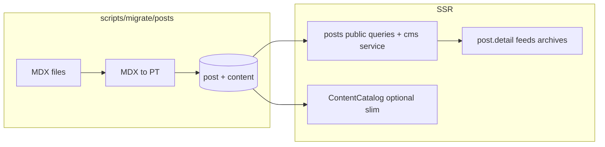

# Postgres 文章与迁移方案

## 现状与约束

- **页面模式（对标实现）**：[page](src/server/db/schema.ts) 元数据表 + [content](src/server/db/schema.ts) 共享修订表（`type` / `owner_id` / `body` JSONB / `headings` / `image_sources`）；业务在 [src/server/cms/pages/](src/server/cms/pages/)（`repository` / `service` / `projection` / `schema`）；公开渲染 [routes/page.detail.tsx](src/routes/page.detail.tsx) 使用 `PortableTextBody`；管理端 `/wp-admin/pages/*` + [src/shared/api-actions.ts](src/shared/api-actions.ts) 中 `admin.listPages` … `publishLatest` 等。
- **文章现状（本计划将废弃）**：当前由 Fumadocs [source.config.ts](source.config.ts) + `#source/server` 在构建期编译 MDX；[ContentCatalog](src/server/catalog/catalog.ts) `build()` 中 `postEntries.map(buildPost)` 得到 **`allPosts` 全量内存快照**；公开路由依赖 `getCatalog()` 同步读。**目标态**为无 Fumadocs、无 `#source`、文章读写一律 Postgres（见下文「完全移除 Fumadocs」与「动态查询」）。
- **与页面的对比**：`pages` 分支已在 `build()` 里 `await loadCatalogPages()` 读库，但仍是 **启动/reset 时整表装入内存**；你要的文章侧更进一步：**列表、详情、计数、搜索材料等应在各自 loader / service 中走按需 SQL（可用 React `cache()` 去重）**，避免 Catalog 持有「每篇全文 + 全量索引」的长期快照（与后台频繁改文、定时发布的语义也更一致）。
- **全局 slug**：`page.slug` 与 post `slug` / `alias[]` 已在一处校验（`validatePageSlugs` + `indexPosts`）。DB 文章上线后必须把 **DB post slug/alias** 并入 `postSlugs`，与 MDX 时代逻辑一致。

## 语料与「页面迁移脚本」差异（你关心的点）

页面迁移器 [scripts/migrate/pages/mdx-to-portable-text.ts](scripts/migrate/pages/mdx-to-portable-text.ts) **刻意收窄**：不支持围栏代码、数学、Mermaid、表格、脚注、`<Solution>`；`<MusicPlayer>` 仅处理**整段**自闭合 HTML，且依赖 `remark` 把 JSX 落成 `html` 节点（属性解析见 `parseJsxAttributes`）。博文里已出现且必须覆盖的包括：

| 能力                     | 示例 / 说明                                                                                                                                                                                                                                     |
| ------------------------ | ----------------------------------------------------------------------------------------------------------------------------------------------------------------------------------------------------------------------------------------------- |
| 围栏代码块               | 如 [2016-05-06-introduction-to-webpack-part-1.mdx](src/content/posts/2016/2016-05-06-introduction-to-webpack-part-1.mdx) 大量 ` ```bash ` / ` ```html `                                                                                         |
| 行内/块级数学            | [notes/analysis-lecture-i-answers/1.1.mdx](src/content/posts/notes/analysis-lecture-i-answers/1.1.mdx) 中 `$…$`、`\\displaystyle` 等 → PT 的 `mathInline` markDef / `mathBlock`                                                                 |
| `<Solution>…</Solution>` | 同上习题答案 → PT `_type: 'solution'`（子树规则见 [@/shared/portable-text](src/shared/portable-text.ts)）                                                                                                                                       |
| GFM 脚注                 | 如 [2025-12-29-when-book-quality-slips.mdx](src/content/posts/2025/2025-12-29-when-book-quality-slips.mdx) 的 `[^1]` + 定义列表 → `footnoteRef` / `footnoteDefinition`                                                                          |
| 原始 HTML                | `<center>…</center>`（如 [2026-05-05-rush-to-the-dead-summer.mdx](src/content/posts/2026/2026-05-05-rush-to-the-dead-summer.mdx)）→ 需在 mdast 前预处理或专项展开（unwrap 后按 markdown 再解析），否则页面级转换器会直接 `Unsupported raw HTML` |
| Mermaid / 表格           | 全库扫描确认用量；若有则映射到 `mermaid` / `table` 块（编辑器与 PT schema 已支持）                                                                                                                                                              |
| `<MusicPlayer>`          | 当前库内均为 `… />` 自闭合；`center` / `auto` 布尔写法与转换器一致。仍需在迁移脚本里做**回归测试**（含属性顺序、换行），并记录「非自闭合 / 非常规属性」为显式失败项                                                                             |

**结论**：不要复用 `scripts/migrate/pages/mdx-to-portable-text.ts` 作为文章唯一转换路径。应新建 `scripts/migrate/posts/mdx-to-portable-text.ts`（或 `post-mdx-to-pt.ts`），在 `remark` 链上叠加 `remark-math`、`remark-gfm`（脚注）、必要时对 `<Solution>` / `<center>` 做 **迁移前字符串或 mdast 预处理**，再映射到与 [@/shared/pt-bridge](src/shared/pt-bridge.ts) / [PortableTextBody](src/ui/portable-text/PortableTextBody.tsx) 一致的块类型。单元测试仿 [tests/script.migrate-pages-mdx.test.ts](tests/script.migrate-pages-mdx.test.ts)，并增加「代表性博文」夹具（Webpack 长文、习题答案、脚注文、center+MusicPlayer）。

## 数据模型（新建 `post` 表）

在 [src/server/db/schema.ts](src/server/db/schema.ts) 增加 `post` 表，字段与 **现有 frontmatter / ClientPost** 对齐，并贴近 `page` 的可运维性：

- 与 `page` 共用：`slug`（unique）、`title`、`summary`、`cover`、`og`、`published`、`published_at`（对应展示用 `date`，并参与「定时发布」与列表过滤）、`deleted_at`。
- 文章特有：`category`（varchar，存**分类名称**以兼容现有 taxonomy）、`tags`（jsonb `text[]` 或等价）、`alias`（jsonb `text[]`）、`visible`、`comments_enabled`、`show_toc`（对应 `toc`）、`updated_at` 展示可选字段（若与修订 `updated_at` 分工：元数据上的 `updated` 可单独列或从最新修订派生，需在 projection 里定一条规则）。
- `published_revision_id`：与 `page` 相同语义，指向 `content.id` 且 `content.type = 'post'`、`owner_id = post.id`。
- **不**把 `slug`/`alias` 放进 PT body（与现有一致）。

Drizzle：`drizzle/` 新 migration + `snapshot.json`（按 AGENTS 中页面 toggle 的同样流程）。

## CMS 层（对标 `cms/pages`）

新增目录 `src/server/cms/posts/`：

- **repository**：CRUD `post`、按 `type='post'` 操作 `content`（复制 [repository.ts](src/server/cms/pages/repository.ts) 中修订号、`FOR UPDATE`、draft/publish 状态机模式）。
- **service**：**写路径** `createPost`、`saveDraft`、`publishLatest`、`updatePostMeta`、`softDelete`/`restore`（与 page 对称）；**读路径** 提供 `getPostPublishedOrPreviewBySlug`、`listPostMetasForCatalogSlugCheck` 等供 loader / Catalog 轻量查询使用；保存路径调用现有 `validatePortableTextBody`、`collectHeadings`、`collectImageStoragePaths`、`prerenderPortableTextBody`（与 page 一致，见 [service.ts](src/server/cms/pages/service.ts)）。避免再导出「一次性装入全部正文」的 `loadCatalogPosts` 式 API 作为公开读主路径。
- **projection**：`CmsPost` → 内部 `Post` 形状（见下节 catalog）。
- **schema / Zod**：对标 [src/server/cms/pages/schema.ts](src/server/cms/pages/schema.ts)。

共享 DTO：新建 [src/shared/cms-posts.ts](src/shared/cms-posts.ts)（或并列模块），供 admin UI 与 `useApiFetcher` 使用。

## 管理端 API 与缓存失效

- 在 [src/shared/api-actions.ts](src/shared/api-actions.ts) 增加 `admin.listPosts`、`getPost`、`upsertPostMeta`、`deletePost`、`restorePost`、`listPostRevisions`、`savePostDraft`、`publishPostLatest`、`unpublishPost`、`previewPost`（命名可与现有 page 对称，便于检索）。
- 在 `src/routes/api/actions/` 下新增对应 resource 模块（复制 page 系列 handler 的结构，内部调用 `cms/posts/service`）。
- **缓存失效**：post 写入后除 `ContentCatalog.reset()`（若仍保留轻量 catalog）外，凡有 **进程内缓存**（如 [search](src/server/search/index.ts) 的 `serverPromise`、Orama 索引）必须显式 eviction 或版本戳，避免读到旧全文/旧摘要。

## 后台文章编辑与管理（在 Page 编辑器基础上扩展）

目标：**正文编辑与 Page 完全一致**（同一套 Tiptap + PT 桥 + 自定义块），差异集中在 **元数据侧栏、列表页、API 契约与路由参数**；避免维护第二套富文本编辑器。

### 路由与信息架构（对标 `wp-admin/pages`）

- 在 [src/routes.ts](src/routes.ts) 注册 `/wp-admin/posts`、`/wp-admin/posts/new`、`/wp-admin/posts/:id/edit`（与 `pages` 路由块相邻，便于运维）。
- 列表：[routes/wp-admin.pages.tsx](src/routes/wp-admin.pages.tsx) 模式 → 新增 `wp-admin.posts.tsx`：表格列（标题、`slug`、分类、`published`/`published_at`、`visible`、更新时间）、搜索/分页、新建入口、进入编辑、软删/恢复（若 page 列表已具备则对称实现）。
- 新建：`wp-admin.posts.new.tsx`：首屏写入默认 `post` 元数据 + 空 PT 草稿（或占位块），创建成功后 **重定向到** `/wp-admin/posts/:id/edit`（与 `pages/new` 一致）。
- 编辑：`wp-admin.posts.$id.edit.tsx`：加载 `getPost` + 当前 draft/published 分支、冲突 token、自动保存/发布按钮组与 page 对齐。

### Shell 与组件复用策略

- **推荐结构**：新增 `PostEditorShell.tsx`（路径建议 `src/ui/admin/posts/`，与 `src/ui/admin/pages/` 并列），**复制并收敛** [PageEditorShell.tsx](src/ui/admin/pages/PageEditorShell.tsx) 的 **布局骨架**（顶栏标题、保存/发布/冲突处理、主从栏栅格、加载与错误边界），通过 **props/slots** 区分：
  - `metaSidebar` 插槽渲染 **Post 专用** 侧栏，而非把 `MetaSidebar`（页面专用 `show_friends` 等）硬改成 union。
  - 后续若双端重复过多，再抽取 **无领域语义的** `AdminContentEditorLayout`（仅壳 + actions slot），`PageEditorShell` / `PostEditorShell` 薄包装 —— 实施时以「先 post 壳落地、再按需抽取」为序，避免过早大重构。
- **正文**：直接复用 [PageBodyEditor.tsx](src/ui/admin/pages/PageBodyEditor.tsx)（同一 `PortableText` ↔ ProseMirror 管线、SlashMenu、BubbleMenu、图片 NodeView、数学/Mermaid 等）。Post 路由把 `initialBody` / `onBodyChange` 接到与 page 相同的 state 机即可。
- **元数据**：新建 `PostMetaSidebar.tsx`（同目录），字段对齐历史 frontmatter / `ClientPost`：
  - `slug`（只读或受控改 slug + 服务端 `deriveSlug` 提示）、`title`、`summary`、`cover`（图库挑选与 page 一致）、`og`、`published`、`published_at`（日期时间，含定时发布语义）、`visible`、`comments_enabled`、`show_toc`；
  - `category`：**分类名称** 下拉或自动完成（数据源：`listCategories` 已有 API），保存前校验名称存在于 `category` 表（与现 `validateTaxonomies` 一致）；
  - `tags`：多选/标签输入（名称列表），保存为 jsonb；可选「跳转 `/wp-admin/tags` 新建」链；
  - `alias[]`：多行或 chip 列表编辑器，保存前跑全局 slug 冲突检测（post↔post、post↔page）；
  - **不包含** `show_friends`（页面专属）。
- **客户端状态**：新增 [src/client/hooks/use-create-post-draft.ts](src/client/hooks/use-create-post-draft.ts)（及编辑态 fetch 模式）与 `@/shared/cms-posts` 中的 DTO 对齐，**镜像** [use-create-page-draft.ts](src/client/hooks/use-create-page-draft.ts) / `cms-pages` 的字段拆分，避免 `client` 导入 `ui`。
- **预览**：`previewPost` API 与 page 的 `previewPage` 对称，服务端对当前 PT 做与公开路由一致的组件映射（可复用现有 prerender 辅助）。
- **管理导航**：在 admin 主导航/侧栏中增加「文章」入口，指向 `/wp-admin/posts`（具体组件定位现有 pages 链接旁）。

### 与 Page 管理端的差异一览

| 维度       | Page                               | Post                                        |
| ---------- | ---------------------------------- | ------------------------------------------- |
| 元数据侧栏 | `MetaSidebar`（`show_friends` 等） | `PostMetaSidebar`（分类/标签/别名/visible） |
| 公开 URL   | `/:slug`                           | `/posts/:slug`                              |
| 全局 slug  | `page.slug`                        | `slug` + `alias[]`                          |
| 列表过滤   | 无 taxonomy                        | 可按分类/标签筛选（可选迭代）               |

## 完全移除 Fumadocs 与依赖替换

**范围**：不仅去掉 `posts` 集合，而是 **卸载 `fumadocs-core`、`fumadocs-mdx`**，删除 **`#source` 虚拟模块与 `.source` 生成物依赖**，并处理所有仍从 Fumadocs 子路径导入的代码。

### 依赖与构建

- [package.json](package.json)：使用 `vp remove` 移除 `fumadocs-core`、`fumadocs-mdx`；确认无传递依赖仍锁在 lockfile 中需清理。
- [vite.config.ts](vite.config.ts)：移除 `import mdx from 'fumadocs-mdx/vite'`、`source.config` 与 `await mdx({ default, posts })`；`plugins` 数组不再包含 fumadocs MDX 插件。构建应 **不再** 生成或解析 `src/content/posts` 为 SSR 模块。
- **删除** [source.config.ts](source.config.ts)（整文件）；若仍需集中存放 **仅迁移脚本** 用的 remark 配置，可迁到 `scripts/` 下独立模块（不进 Vite）。

### 路径与生成物

- [tsconfig.json](tsconfig.json) / [src/env.d.ts](src/env.d.ts)（若声明 `#source`）：移除 `#source/*` → `.source/*` 映射与三斜线引用。
- [tests/contract.boundaries.test.ts](tests/contract.boundaries.test.ts)：更新 import 边界白名单，去掉 `#source/`。
- `.source/`：随 fumadocs-mdx 移除后不再由构建生成；**`.gitignore` 已忽略则保持**；文档中删除「Fumadocs 生成内容」表述（[AGENTS.md](AGENTS.md) 路径别名表、`skills-lock.json` 若引用 Fumadocs 技能说明则同步）。

### 代码级替换（按当前仓库 grep 结果）

| 原依赖点                                                                                                       | 处理方式                                                                                                                                                                                                        |
| -------------------------------------------------------------------------------------------------------------- | --------------------------------------------------------------------------------------------------------------------------------------------------------------------------------------------------------------- |
| [src/server/catalog/catalog.ts](src/server/catalog/catalog.ts) `TOCItemType` from `fumadocs-core/toc`          | 内联最小结构类型或迁到 `@/shared/toc` 已有类型旁，仅保留 catalog 需要的字段                                                                                                                                     |
| [src/server/catalog/schema.ts](src/server/catalog/schema.ts) `StructuredData` from `fumadocs-core/mdx-plugins` | 定义本地最小类型 / 或 `Record<string, unknown>` + 搜索索引显式字段                                                                                                                                              |
| [src/server/markdown/rehype-code.ts](src/server/markdown/rehype-code.ts) `fumadocs-core/.../rehype-code`       | 改用 `@shikijs/rehype`（或项目已用的 `shiki` + 自建 wrapper）复刻 `rehypeCodeWithGlobalCache` 行为；类型不再从 fumadocs 引入                                                                                    |
| [src/server/search/index.ts](src/server/search/index.ts) `fumadocs-core/search/server`                         | 使用 **`@orama/orama` 官方 API** + 现有 `@orama/tokenizers` 构建索引（把原 `AdvancedIndex` / `initAdvancedSearch` 的字段契约迁到自建薄封装）；更新 [tests/service.search.test.ts](tests/service.search.test.ts) |
| [src/ui/mdx/MdxContent.tsx](src/ui/mdx/MdxContent.tsx) `#source/browser`                                       | **删除**公开文章 MDX 动态加载分支；若文件仅服务 post，可删文件或收缩为仅 admin/其它仍存在的 MDX 消费方（目标为 **零 `#source`**）                                                                               |
| 其它 `#source/server`                                                                                          | 仅 catalog 曾用 post；移除后 catalog 不再 import                                                                                                                                                                |

### 文档与 CI

- [AGENTS.md](AGENTS.md) / [CLAUDE.md](CLAUDE.md) symlink：删除 Fumadocs MDX 文章、 `#source`、及相关技能触发描述；改为「文章仅 DB + PT」。
- 若 `.vscode/settings.json` 等存在 `fumadocs` 字典项可清理。

## API 与路由（管理端 API）

- 在 [src/shared/api-actions.ts](src/shared/api-actions.ts) 增加 `admin.listPosts`、`getPost`、`upsertPostMeta`、`deletePost`、`restorePost`、`listPostRevisions`、`savePostDraft`、`publishPostLatest`、`unpublishPost`、`previewPost`（命名可与现有 page 对称，便于检索）。
- 在 `src/routes/api/actions/` 下新增对应 resource 模块（复制 page 系列 handler 的结构，内部调用 `cms/posts/service`）。

## Catalog 与动态数据库查询（核心调整）

**目标**：打破「Catalog = 全量 Post 内存数据库」；**Postgres 为读路径上的真相**，Catalog 仅保留仍值得进程级缓存的切片（或逐步收缩为 taxonomies / friends 等）。

### 现状（需替换的模式）

在 [catalog.ts `ContentCatalog.build`](src/server/catalog/catalog.ts) 中：`allPosts` 为完整 `Post[]`（含 MDX `body`），并派生 `postsByCategory`、`postsByTag`、`bySlug`、`byAlias`、`permalinks`；`getPost` / `getPosts` / `getPostsByTaxonomy` 均为 **同步**、**零 SQL**。

### 目标架构（推荐方向）

1. **详情与需全文的场景**（`post.detail`、admin 预览、RSS 全文若需要）：loader 直接 `await` 调用 **`@/server/cms/posts/service`**（或薄封装 `getPostDetailFromDb(slug)`），一次（或少数几次）SQL 取 meta + 当前应展示的 `content` 修订 + PT `body`；**不经过** `catalog.getPost` 取全文。
2. **列表与侧边栏**（首页、归档、分类/标签列表、sidebar「近期文章」）：用 **带过滤/排序/分页的 SQL**（或 repository 中已有 pattern）返回 `ListingPostCard` / `ClientPost` 轻量 DTO（不含大 `body`，或仅摘要字段）；与现 `getClientPosts` 行为对齐的过滤（`visible`、`published_at`、dev-only 草稿）写在 **WHERE** 里，而不是 `applyPostOptions` 扫全表。
3. **分类 / 标签计数与 `postsByTag`**：改为 **聚合查询**（`COUNT` / `GROUP BY`）或物化在迁移后的维护路径上；`buildTags` / `buildCategories` 入参从「内存 bucket」改为「DB 聚合结果 + 已有 category/tag 行」。
4. **全局 slug 校验**（`validatePageSlugs` + post 侧 `slug`/`alias[]`）：`ContentCatalog.build` 内改为 **`SELECT slug` + `unnest(alias)`**（或等价）拉轻量集合构建 `postSlugs: Set<string>`，**不要**加载每篇正文；catalog 冷启动或 reset 时执行一次即可。
5. **`validateTaxonomies` / `fillMissingPostCovers`**：对「仍引用某 category 名的文章数」等，用 **SQL EXISTS / COUNT** 替代 `catalog.getPostsByTaxonomy`；删除守卫（[categories/service.ts](src/server/categories/service.ts)）同样改为查库，错误文案改为「后台文章」而非 MDX。
6. **搜索**：[search/index.ts](src/server/search/index.ts) 当前在 `buildServer` 里 `catalog.getPosts(...).map(structuredData)`；应改为 **从 DB 拉构建索引所需字段**（至少 `slug,title,summary`；若仍要 `structuredData` 则列存或默认可空），与 Catalog 解耦。
7. **API 形态**：保留 `getCatalog()` 给仍依赖它的路径（taxonomies、pages、friends）逐步收口；对 post 相关方法要么 **弃用**（改调用方直查 service），要么改为 **async** 并内部查库（破坏性较大，需统一改调用链）。更干净的做法是：**新增** `server/posts/public-queries.ts`（命名示例）集中导出 `listPostsForHome`、`getPostForDetail`，路由只依赖该模块 + `cache()`。

### `Post` 类型与兼容

- [schema.ts `Post`](src/server/catalog/schema.ts) 仍可表示「详情页用的完整行」，但 **实例不再常驻于 `ContentCatalog.allPosts`**；由 DB 投影函数返回即可。
- `body: PortableTextBody`；去掉 `mdxPath`；`structuredData` 处理同前（搜索改 DB 后尤其要定义默认值）。

### 与 `ContentCatalog.reset()` 的关系

- 若 Catalog 仍缓存 taxonomy 与 slug 集：**post 变更后 reset 仍必要**，但 reset 成本应随「全量 post 正文」移除而 **显著下降**。
- 若后续 Catalog 仅含 friends + 可选缓存：可评估 **按版本戳局部失效** 替代整实例重建。

## Catalog 与类型统一（类型与校验收口）

1. 扩展 [src/server/catalog/schema.ts](src/server/catalog/schema.ts)：`Post` 与 `Page` 对齐为 **`body: PortableTextBody`**，去掉 `mdxPath`；`imageSources` 保留（来自修订行或投影）；`structuredData`：
   - 方案 A（推荐）：对 DB 文章填 **最小默认结构**（或空对象），保证 [search/index.ts](src/server/search/index.ts) 的 `structuredData` 字段类型稳定；
   - 方案 B：从标题/摘要生成轻量 JSON-LD（若需 SEO 增强再迭代）。
2. **slug 索引**：`postSlugs` 由 DB 轻量查询构建；`validatePageSlugs` 逻辑不变。
3. **分类/标签删除提示**：[formatBlockMessage](src/server/categories/service.ts) 等处的「请先在 MDX frontmatter 中改写」改为中性表述（例如「请先在文章中修改分类/标签」）。

## 公开渲染与数据面

- [routes/post.detail.tsx](src/routes/post.detail.tsx)：与 [routes/page.detail.tsx](src/routes/page.detail.tsx) 对齐——**loader 内先 `await` DB**（published / admin 草稿分支），再渲染 `PortableTextBody` + heading slugs；去掉 `preloadPostBody(mdxPath)` / `PostBody`（[MdxContent.tsx](src/ui/mdx/MdxContent.tsx)）的 MDX 分支；**不再依赖** `getCatalog().getPost(slug)` 取全文。
- **评论 / Like / permalink**：沿用 `post.permalink`（`/posts/:slug`），确保 DB 投影与现有一致。
- **OG**：[routes/image.og.ts](src/routes/image.og.ts) 改为 **DB 查询** `title/summary/cover`（或复用 `getPostDetailFromDb` 的轻量投影），不再依赖 `catalog.getPost`。
- **Feed / Sitemap / archives / tags / categories / home**：改为 **DB 查询或专用 service**（与上节一致）；URL 契约不变（AGENTS 要求保留公共 URL）。调用链审计：凡 `getCatalog().getPosts` / `getPost` / `getPostsByTaxonomy` 处逐项替换或改为 async 包装。

## 迁移脚本（`scripts/migrate/posts/`）

对标 [scripts/migrate/README.md](scripts/migrate/README.md) 与 [scripts/migrate/pages/cli.ts](scripts/migrate/pages/cli.ts)：

- **CLI**：`--source-dir` 默认可指向仓库内 `src/content/posts`（递归 `**/*.mdx`，排除 `_` 前缀与 `source.config.ts` 中一致的忽略规则）；`--apply` / `--force` 行为与 page 相同（按 `slug` 幂等跳过）。
- **流程**：读文件 → 解析 YAML（字段对齐 `postSchema`）→ **正文预处理**（Solution/center 等）→ `remark` 管道 → PT body → 解析封面与内联图（复用 `resolveSrcToStoragePath` + `findImageByStoragePath`）→ MusicPlayer id 校验 → `createPost` + `publishLatest`（或等价「插入元数据 + 首版 published 修订」事务）。
- **依赖**：重解析逻辑留在 `scripts/`，不进入 SSR bundle（与 page 迁移器相同约束）。

## 仓库内 MDX 语料（仅迁移脚本读取）

- `src/content/posts/**/*.mdx` **不再参与 Vite / SSR 编译**；仅作为 **frozen 迁移源**（与 `src/content/pages` 策略一致）。新增 `src/content/posts/_README.md` 说明：日常编辑走 `/wp-admin/posts`，勿改 MDX 以「更新线上」。
- 迁移与 dry-run **只读**该目录；`--apply` 写入 `post` + `content` 后，线上真相仍为数据库。

## 风险与验证顺序

1. 对 `src/content/posts` 跑迁移器 **dry-run**，输出「不支持的 mdast/html」统计，直至为 0 再 `--apply`。
2. `vp check`、`vp test run`（含新 migrator 测试 + `cms/posts` service 测试 + 必要 contract）。
3. 手动抽测：一篇含代码、一篇含数学+Solution、一篇含脚注、一篇含 `<center>`+`MusicPlayer`。


