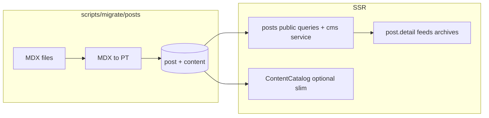

# Postgres 文章与迁移方案

## 现状与约束

- **页面模式（对标实现）**：[page](src/server/db/schema.ts) 元数据表 + [content](src/server/db/schema.ts) 共享修订表（`type` / `owner_id` / `body` JSONB / `headings` / `image_sources`）；业务在 [src/server/cms/pages/](src/server/cms/pages/)（`repository` / `service` / `projection` / `schema`）；公开渲染 [routes/page.detail.tsx](src/routes/page.detail.tsx) 使用 `PortableTextBody`；管理端 `/wp-admin/pages/*` + [src/shared/api-actions.ts](src/shared/api-actions.ts) 中 `admin.listPages` … `publishLatest` 等。
- **文章现状（本计划将废弃）**：当前由 Fumadocs [source.config.ts](source.config.ts) + `#source/server` 在构建期编译 MDX；[ContentCatalog](src/server/catalog/catalog.ts) `build()` 中 `postEntries.map(buildPost)` 得到 **`allPosts` 全量内存快照**；公开路由依赖 `getCatalog()` 同步读。**目标态**为无 Fumadocs、无 `#source`、文章读写一律 Postgres。
- **与页面的对比**：`pages` 分支已在 `build()` 里 `await loadCatalogPages()` 读库，但仍是 **启动/reset 时整表装入内存**；文章侧更进一步：**列表、详情、计数、搜索材料等应在各自 loader / service 中走按需 SQL（可用 React `cache()` 去重）**，避免 Catalog 持有「每篇全文 + 全量索引」的长期快照。
- **全局 slug**：`page.slug` 与 post `slug` / `alias[]` 已在一处校验（`validatePageSlugs` + `indexPosts`）。DB 文章上线后必须把 **DB post slug/alias** 并入 `postSlugs`，与 MDX 时代逻辑一致。

## 语料与「页面迁移脚本」差异

页面迁移器 [scripts/migrate/pages/mdx-to-portable-text.ts](scripts/migrate/pages/mdx-to-portable-text.ts) **刻意收窄**：不支持围栏代码、数学、Mermaid、表格、脚注、`<Solution>`；`<MusicPlayer>` 仅处理**整段**自闭合 HTML。博文里已出现且必须覆盖的包括：

| 能力                     | 示例 / 说明                                                                                                                          |
| ------------------------ | ------------------------------------------------------------------------------------------------------------------------------------ |
| 围栏代码块               | `src/content/posts/2016/2016-05-06-introduction-to-webpack-part-1.mdx` 大量 ` ```bash ` / ` ```html `                                |
| 行内/块级数学            | `src/content/posts/notes/analysis-lecture-i-answers/1.1.mdx` 中 `$…$`、`\displaystyle` 等 → PT 的 `mathInline` markDef / `mathBlock` |
| `<Solution>…</Solution>` | 同上习题答案 → PT `_type: 'solution'`（子树规则见 [@/shared/portable-text](src/shared/portable-text.ts)）                            |
| GFM 脚注                 | `src/content/posts/2025/2025-12-29-when-book-quality-slips.mdx` 的 `[^1]` + 定义列表 → `footnoteRef` / `footnoteDefinition`          |
| 原始 HTML                | `<center>…</center>`（如 `2026-05-05-rush-to-the-dead-summer.mdx`）→ 需在 mdast 前预处理或专项展开                                   |
| Mermaid / 表格           | 全库扫描确认用量；若有则映射到 `mermaid` / `table` 块（编辑器与 PT schema 已支持）                                                   |
| `<MusicPlayer>`          | 当前库内均为自闭合；仍需在迁移脚本里做回归测试，并记录「非自闭合 / 非常规属性」为显式失败项                                          |

**结论**：不要复用 `scripts/migrate/pages/mdx-to-portable-text.ts`。应新建 `scripts/migrate/posts/mdx-to-portable-text.ts`，在 `remark` 链上叠加 `remark-math`、`remark-gfm`（脚注），必要时对 `<Solution>` / `<center>` 做 **迁移前字符串或 mdast 预处理**，再映射到与 [@/shared/pt-bridge](src/shared/pt-bridge.ts) / [PortableTextBody](src/ui/portable-text/PortableTextBody.tsx) 一致的块类型。单元测试仿 [tests/script.migrate-pages-mdx.test.ts](tests/script.migrate-pages-mdx.test.ts)，并增加代表性夹具。

---

# 伪代码级详细开发链路

以下按 8 个 todo 逐项展开，精确到文件路径、类型签名、函数体步骤、调用链替换与测试策略。实施时请按编号顺序推进，因为上游（schema/CMS）是下游（UI/路由）的前置依赖。

---

## 1. Schema: `post` 表与迁移 (`schema-post-table`)

### 1.1 目标

在 `src/server/db/schema.ts` 新增 `post` 表，与 `page` 表共用 `content` 修订表（`type='post'`）。

### 1.2 `src/server/db/schema.ts` 新增代码

```ts
// ===== post 表（与 page 对称，增加文章特有字段） =====
export const post = pgTable(
  'post',
  {
    id: bigserial('id', { mode: 'bigint' }).primaryKey().notNull(),
    createdAt: timestamp('created_at', { withTimezone: true, mode: 'date' })
      .notNull()
      .$defaultFn(() => new Date()),
    updatedAt: timestamp('updated_at', { withTimezone: true, mode: 'date' })
      .notNull()
      .$defaultFn(() => new Date()),
    deletedAt: timestamp('deleted_at', { withTimezone: true, mode: 'date' }),
    slug: varchar('slug', { length: 80 }).unique().notNull(),
    title: varchar('title', { length: 200 }).notNull(),
    summary: text('summary').notNull().default(''),
    cover: text('cover').notNull().default(''),
    og: text('og'),
    published: boolean('published').notNull().default(true),
    commentsEnabled: boolean('comments_enabled').notNull().default(true),
    showToc: boolean('show_toc').notNull().default(false),
    visible: boolean('visible').notNull().default(true),
    publishedAt: timestamp('published_at', { withTimezone: true, mode: 'date' })
      .notNull()
      .$defaultFn(() => new Date()),
    publishedRevisionId: bigint('published_revision_id', { mode: 'bigint' }),
    // 文章特有字段
    category: varchar('category', { length: 20 }).notNull().default(''),
    tags: jsonb('tags')
      .notNull()
      .default(sql`'[]'::jsonb`),
    alias: jsonb('alias')
      .notNull()
      .default(sql`'[]'::jsonb`),
  },
  (table) => [
    index('idx_post_slug').on(table.slug),
    index('idx_post_deleted_at').on(table.deletedAt),
    index('idx_post_category').on(table.category),
    index('idx_post_published_at').on(table.publishedAt),
  ],
)
```

**设计决策：**

- `category` 存 **分类名称**（varchar），与现有 MDX frontmatter 及 `ClientPost.category` 对齐；不存外键 ID，因为 taxonomy renaming 由运营保证同步。
- `tags` / `alias` 为 JSONB `text[]`；Drizzle 读出来是 `string[]`。
- `publishedRevisionId` 仍为 nullable 且 **不建 DDL FK**，与 `page` 保持一致（应用层在事务内保证顺序）。
- `updatedAt` 由 `updatePostMetaById` / save/publish 事务内 `SET updated_at = now()` 维护；展示层若需要「文章更新时间」可从该字段读取，不必再从 revision 派生。

### 1.3 类型导出

在同文件底部（或 Drizzle 类型推断处）确保导出：

```ts
export type PostMetaRow = typeof post.$inferSelect
export type NewPostMeta = typeof post.$inferInsert
```

### 1.4 Drizzle Migration 流程

1. 运行 `vp dlx drizzle-kit generate --name add_post_table`（或等效命令）生成分支迁移。
2. 在 `drizzle/` 下得到新目录，内含 `migration.sql` 与 `snapshot.json`。
3. **必须手工校验 `migration.sql`** 包含：
   ```sql
   CREATE TABLE "post" ( ... );
   CREATE INDEX "idx_post_slug" ON "post" ("slug");
   CREATE INDEX "idx_post_deleted_at" ON "post" ("deleted_at");
   CREATE INDEX "idx_post_category" ON "post" ("category");
   CREATE INDEX "idx_post_published_at" ON "post" ("published_at");
   ```
4. **snapshot.json** 必须在 `tables` 中新增 `post` 实体，并在 `post` 的 `indexes` 中正确列出上述 4 个索引；`prevId` 链需衔接上一版本。
5. 迁移文件 **不** 改动现有 `content` 表结构（`type='post'` 已能被现有 `varchar(16)` 容纳）。
6. 运行 `vp dlx drizzle-kit migrate` 在本地/测试库应用；生产部署时由 Dockerfile `ENTRYPOINT` 或运维脚本执行。

### 1.5 测试

- `tests/contract.db-schema.test.ts`（若存在）或新建 `tests/db-schema.test.ts`：
  - 断言 `db.select().from(post).limit(0)` 不抛语法错误。
  - 断言 `content` 表能插入 `type='post', owner_id=<post.id>` 且 `uq_content_owner_revision` 唯一索引生效。

---

## 2. CMS 层: `src/server/cms/posts/` (`cms-posts-layer`)

新增目录 `src/server/cms/posts/`，内部 4 个文件对标 `src/server/cms/pages/`。

### 2.1 `src/server/cms/posts/repository.ts`

**说明**：`content` 表已是多态共享，因此 **content 的读写函数直接复用** `src/server/cms/pages/repository.ts` 中已导出的：`findContentById`, `findLatestRevision`, `findLatestDraft`, `listRevisions`, `saveDraftRevision`, `publishLatestRevision`, `maxRevisionNo`。

若 `pages/repository.ts` 未导出这些泛化函数，则先将其重命名/泛化为接受 `type: ContentType` 参数并导出，再在 `posts/repository.ts` 中 re-export。禁止复制粘贴 content SQL。

**`post` 表专属 CRUD：**

```ts
import { eq, and, sql, like, desc, asc, isNull, gte, lte } from 'drizzle-orm'
import { db } from '@/server/db/query'
import { post } from '@/server/db/schema'

export interface ListPostsFilters {
  q?: string
  includeDeleted?: boolean
  offset?: number
  limit?: number
  category?: string
  tag?: string // 用 JSONB contains 查询
}

function buildPostsWhere(filters: ListPostsFilters): SQL | undefined {
  const conditions: SQL[] = []
  if (!filters.includeDeleted) conditions.push(isNull(post.deletedAt))
  if (filters.q) conditions.push(or(like(post.title, `%${filters.q}%`), like(post.slug, `%${filters.q}%`)))
  if (filters.category) conditions.push(eq(post.category, filters.category))
  if (filters.tag) conditions.push(sql`${post.tags} @> ${JSON.stringify([filters.tag])}::jsonb`)
  return conditions.length ? and(...conditions) : undefined
}

export async function listPostMetas(filters: ListPostsFilters = {}): Promise<PostMetaRow[]> {
  return db
    .select()
    .from(post)
    .where(buildPostsWhere(filters))
    .orderBy(desc(post.publishedAt))
    .limit(filters.limit ?? 50)
    .offset(filters.offset ?? 0)
}

export async function countPostMetas(filters: ListPostsFilters = {}): Promise<number> {
  const [row] = await db
    .select({ count: sql<number>`count(*)` })
    .from(post)
    .where(buildPostsWhere(filters))
  return row.count
}

export async function findPostMetaById(id: bigint): Promise<PostMetaRow | null> {
  const rows = await db.select().from(post).where(eq(post.id, id)).limit(1)
  return rows[0] ?? null
}

export async function findPostMetaBySlug(slug: string): Promise<PostMetaRow | null> {
  const rows = await db.select().from(post).where(eq(post.slug, slug)).limit(1)
  return rows[0] ?? null
}

export async function findPublicPostMetaBySlug(slug: string): Promise<PostMetaRow | null> {
  const rows = await db
    .select()
    .from(post)
    .where(and(eq(post.slug, slug), isNull(post.deletedAt)))
    .limit(1)
  return rows[0] ?? null
}

export async function listPublicPostMetas(): Promise<PostMetaRow[]> {
  return db.select().from(post).where(isNull(post.deletedAt)).orderBy(desc(post.publishedAt))
}

export async function insertPostMeta(values: NewPostMeta): Promise<PostMetaRow> {
  const [row] = await db.insert(post).values(values).returning()
  return row
}

export async function updatePostMetaById(
  id: bigint,
  patch: Partial<Omit<NewPostMeta, 'id' | 'createdAt'>>,
): Promise<PostMetaRow | null> {
  const [row] = await db
    .update(post)
    .set({ ...patch, updatedAt: new Date() })
    .where(eq(post.id, id))
    .returning()
  return row ?? null
}

export async function softDeletePostMeta(id: bigint): Promise<boolean> {
  const [row] = await db
    .update(post)
    .set({ deletedAt: new Date(), updatedAt: new Date() })
    .where(eq(post.id, id))
    .returning()
  return row !== undefined
}

export async function restorePostMeta(id: bigint): Promise<boolean> {
  const [row] = await db.update(post).set({ deletedAt: null, updatedAt: new Date() }).where(eq(post.id, id)).returning()
  return row !== undefined
}
```

### 2.2 `src/server/cms/posts/schema.ts`

```ts
import { z } from 'zod'
import { portableTextBodySchema } from '@/shared/portable-text'

// 复用 pages 的 slug 规则（注意 page 允许 [._-]，post slug 也沿用相同校验，但 deriveSlug 输出始终 kebab-case）
const slugSchema = z
  .string()
  .trim()
  .min(1)
  .max(80)
  .regex(/^[a-z0-9]+(?:[._-][a-z0-9]+)*$/, 'Invalid slug')

const optionalText = (max: number) =>
  z
    .string()
    .trim()
    .max(max)
    .optional()
    .transform((v) => v ?? '')

const idSchema = z.object({ id: z.string().min(1) })

export const listPostsSchema = z.object({
  q: z.string().trim().max(100).optional(),
  includeDeleted: z.coerce.boolean().optional(),
  offset: z.coerce.number().int().min(0).optional(),
  limit: z.coerce.number().int().min(1).max(100).optional(),
  category: z.string().trim().max(20).optional(),
  tag: z.string().trim().max(20).optional(),
})

export const getPostSchema = idSchema
export const deletePostSchema = idSchema
export const restorePostSchema = idSchema
export const unpublishPostSchema = idSchema
export const listPostRevisionsSchema = idSchema

export const upsertPostMetaSchema = z.object({
  id: z.string().min(1).optional(),
  slug: slugSchema.optional(),
  title: z.string().trim().min(1).max(200),
  summary: optionalText(500),
  cover: z.string().trim().max(500).optional().default(''),
  og: z
    .string()
    .trim()
    .max(500)
    .nullable()
    .optional()
    .transform((v) => (v === undefined || v === '' ? null : v)),
  published: z.coerce.boolean().optional(),
  commentsEnabled: z.coerce.boolean().optional(),
  showToc: z.coerce.boolean().optional(),
  visible: z.coerce.boolean().optional(),
  publishedAt: z.iso.datetime({ offset: true }).optional(),
  category: z.string().trim().max(20).optional().default(''),
  tags: z.array(z.string().trim().max(20)).optional().default([]),
  alias: z
    .array(
      z
        .string()
        .trim()
        .max(80)
        .regex(/^[a-z0-9]+(?:-[a-z0-9]+)*$/),
    )
    .optional()
    .default([]),
})

export const savePostBodySchema = z.object({
  id: z.string().min(1),
  body: portableTextBodySchema,
  expectedClientRevisionToken: z.uuid().nullable().optional(),
  force: z.coerce.boolean().optional(),
  publishedAt: z.iso.datetime({ offset: true }).optional(),
})

export const previewPostBodySchema = z.object({
  body: portableTextBodySchema,
})

// Re-export wire types（定义在 @/shared/cms-posts）
export type {
  DeletePostInput,
  GetPostInput,
  ListPostRevisionsInput,
  ListPostsInput,
  PreviewPostBodyInput,
  RestorePostInput,
  SavePostBodyInput,
  UnpublishPostInput,
  UpsertPostMetaInput,
} from '@/shared/cms-posts'
```

### 2.3 `src/server/cms/posts/projection.ts`

```ts
import type { PostMetaRow } from '@/server/db/schema'
import type { ContentRow } from '@/server/cms/pages/repository' // 共享 content 行类型
import type { PortableTextBody, MarkdownHeading } from '@/shared/portable-text'
import type { ClientPost, AdminPostDto, AdminRevisionDto, AdminPostDetailDto } from '@/shared/cms-posts'

export interface CmsPost extends ClientPost {
  body: PortableTextBody
  imageSources: string[]
  publishedRevisionId: bigint | null
}

export function toCmsPost(
  meta: PostMetaRow,
  publishedRevision: ContentRow | null,
  options: { coverThumbhash?: string; coverWidth?: number; coverHeight?: number } = {},
): CmsPost {
  return {
    title: meta.title,
    date: meta.publishedAt,
    updated: meta.updatedAt,
    comments: meta.commentsEnabled,
    alias: meta.alias,
    tags: meta.tags,
    category: meta.category,
    summary: meta.summary,
    cover: meta.cover,
    coverThumbhash: options.coverThumbhash,
    coverWidth: options.coverWidth,
    coverHeight: options.coverHeight,
    og: meta.og ?? undefined,
    published: meta.published,
    visible: meta.visible,
    toc: meta.showToc,
    slug: meta.slug,
    permalink: `/posts/${meta.slug}`,
    headings: readHeadings(publishedRevision?.headings),
    body: readBody(publishedRevision?.body),
    imageSources: readStringArray(publishedRevision?.imageSources),
    publishedRevisionId: meta.publishedRevisionId,
  }
}

export function toAdminPostDto(row: PostMetaRow): AdminPostDto {
  return {
    id: row.id.toString(),
    slug: row.slug,
    title: row.title,
    summary: row.summary,
    cover: row.cover,
    og: row.og ?? null,
    published: row.published,
    commentsEnabled: row.commentsEnabled,
    showToc: row.showToc,
    visible: row.visible,
    publishedAt: row.publishedAt.toISOString(),
    publishedRevisionId: row.publishedRevisionId?.toString() ?? null,
    createdAt: row.createdAt.toISOString(),
    updatedAt: row.updatedAt.toISOString(),
    deletedAt: row.deletedAt?.toISOString() ?? null,
    category: row.category,
    tags: row.tags,
    alias: row.alias,
  }
}

export function toAdminRevisionDto(row: ContentRow): AdminRevisionDto {
  /* 与 pages 的 toAdminRevisionDto 完全一致，可提取到共享位置 */
}

export interface AdminPostDetailDto {
  post: AdminPostDto
  latestRevision: AdminRevisionDto | null
  publishedRevision: AdminRevisionDto | null
}

// JSONB helpers（与 pages/projection.ts 相同，可提取到共享 util）
function readBody(value: unknown): PortableTextBody {
  /* ... */
}
function readStringArray(value: unknown): string[] {
  /* ... */
}
function readHeadings(value: unknown): MarkdownHeading[] {
  /* ... */
}
```

### 2.4 `src/server/cms/posts/service.ts`

**公开查询（供 loader / catalog 使用，不含大 body）：**

```ts
import { cache } from 'react'

export interface PostVisibilityOptions {
  includeHidden: boolean
  includeScheduled: boolean
}

function isPostVisible(meta: PostMetaRow, asOf: Date = new Date()): boolean {
  if (!meta.visible && !options.includeHidden) return false
  if (meta.publishedAt > asOf && !options.includeScheduled) return false
  return true
}

// ===== 供 Catalog 冷启动使用的轻量全量元数据（不含 body） =====
export async function loadCatalogPostMetas(): Promise<ClientPost[]> {
  const rows = await listPublicPostMetas()
  return rows.map((meta) => ({
    title: meta.title,
    date: meta.publishedAt,
    updated: meta.updatedAt,
    comments: meta.commentsEnabled,
    alias: meta.alias,
    tags: meta.tags,
    category: meta.category,
    summary: meta.summary,
    cover: meta.cover,
    og: meta.og ?? undefined,
    published: meta.published,
    visible: meta.visible,
    toc: meta.showToc,
    slug: meta.slug,
    permalink: `/posts/${meta.slug}`,
    headings: [], // catalog 冷启动不需要 headings；公开路由按需从 content 行读取
  }))
}

// ===== 详情页用（含 body） =====
export interface PostDetail {
  post: CmsPost
  hasNewerDraft: boolean
}

export async function getPostPublishedOrPreviewBySlug(
  slug: string,
  { allowDraft }: { allowDraft: boolean },
): Promise<PostDetail | null> {
  const meta = await findPublicPostMetaBySlug(slug)
  if (!meta) return null

  const publishedRevision = meta.publishedRevisionId ? await findContentById(meta.publishedRevisionId) : null

  if (!allowDraft) {
    if (!publishedRevision) return null
    return { post: toCmsPost(meta, publishedRevision), hasNewerDraft: false }
  }

  const latestDraft = await findLatestDraft('post', meta.id)
  const hasNewerDraft = latestDraft !== null && latestDraft.id !== publishedRevision?.id
  const activeRevision = hasNewerDraft ? latestDraft : publishedRevision
  return { post: toCmsPost(meta, activeRevision), hasNewerDraft }
}

// ===== 列表/归档/分类/标签/搜索 用（轻量，可选含 body 摘要） =====
export async function listPostsForHome(options: PostVisibilityOptions): Promise<ClientPost[]> {
  /* SQL WHERE visible/published_at ORDER BY published_at DESC */
}
export async function listPostsForArchives(options: PostVisibilityOptions): Promise<ClientPost[]> {
  /* 同上，但返回全部（不分页，由 listingLoader 内存分页） */
}
export async function listPostsByTaxonomy(
  taxonomy: { category?: string; tag?: string },
  options: PostVisibilityOptions,
): Promise<ClientPost[]> {
  /* SQL WHERE category = ? 或 tags @> [?] */
}
export async function countPostsByTaxonomy(
  taxonomy: { category?: string; tag?: string },
  options: PostVisibilityOptions,
): Promise<number> {
  /* SQL COUNT */
}
export async function listPostsForSitemap(
  options: PostVisibilityOptions,
): Promise<Pick<ClientPost, 'slug' | 'permalink' | 'date'>[]> {
  /* SELECT slug, published_at */
}
export async function listPostsForFeed(
  options: PostVisibilityOptions & { category?: string; tag?: string; limit?: number },
): Promise<CmsPost[]> {
  /* 按需 JOIN content 取 body */
}
export async function getPostsForSearchIndex(): Promise<{ slug: string; title: string; summary: string }[]> {
  /* SELECT slug, title, summary FROM post WHERE deleted_at IS NULL */
}
export async function getPostForOg(slug: string): Promise<{ title: string; summary: string; cover: string } | null> {
  /* SELECT title, summary, cover FROM post WHERE slug = ? AND deleted_at IS NULL */
}

// ===== Admin =====
export interface AdminPostsListResult {
  posts: AdminPostDto[]
  total: number
  hasMore: boolean
}

export async function listPostsForAdmin(filters: ListPostsFilters = {}): Promise<AdminPostsListResult> {
  const [posts, total] = await Promise.all([listPostMetas(filters), countPostMetas(filters)])
  return {
    posts: posts.map(toAdminPostDto),
    total,
    hasMore: (filters.offset ?? 0) + posts.length < total,
  }
}

export async function getPostDetailForAdmin(id: bigint): Promise<AdminPostDetailDto | null> {
  const meta = await findPostMetaById(id)
  if (!meta) return null
  const [latestDraft, publishedRevision] = await Promise.all([
    findLatestDraft('post', id),
    meta.publishedRevisionId ? findContentById(meta.publishedRevisionId) : null,
  ])
  return {
    post: toAdminPostDto(meta),
    latestRevision: latestDraft ? toAdminRevisionDto(latestDraft) : null,
    publishedRevision: publishedRevision ? toAdminRevisionDto(publishedRevision) : null,
  }
}

export async function listRevisionsForAdmin(id: bigint): Promise<AdminRevisionDto[]> {
  const rows = await listRevisions('post', id)
  return rows.map(toAdminRevisionDto)
}

// ===== 元数据 CRUD =====
const RESERVED_POST_SLUGS = new Set([
  'posts',
  'cats',
  'tags',
  'archives',
  'search',
  'wp-admin',
  'api',
  'feed',
  'sitemap.xml',
  'robots.txt',
])

export interface UpsertPostMetaInput {
  id?: bigint
  slug?: string
  title: string
  summary?: string
  cover?: string
  og?: string | null
  published?: boolean
  commentsEnabled?: boolean
  showToc?: boolean
  visible?: boolean
  publishedAt?: Date
  category?: string
  tags?: string[]
  alias?: string[]
}

function resolveSlugForPost(explicit: string | undefined, title: string): string {
  if (explicit) return explicit
  return deriveSlug(title)
}

export async function createPost(input: UpsertPostMetaInput, _authorId: bigint | null): Promise<AdminPostDto> {
  const slug = resolveSlugForPost(input.slug, input.title)
  if (RESERVED_POST_SLUGS.has(slug)) throw new ActionFailure(400, `Reserved slug: ${slug}`)
  // 全局 slug 冲突在 ContentCatalog.reset() 时校验；保存时可做轻量 SELECT 预判
  const existing = await findPostMetaBySlug(slug)
  if (existing) throw new ActionFailure(409, 'Slug 已存在')

  const row = await insertPostMeta({
    slug,
    title: input.title,
    summary: input.summary ?? '',
    cover: input.cover ?? '',
    og: input.og ?? null,
    published: input.published ?? true,
    commentsEnabled: input.commentsEnabled ?? true,
    showToc: input.showToc ?? false,
    visible: input.visible ?? true,
    publishedAt: input.publishedAt ?? new Date(),
    category: input.category ?? '',
    tags: input.tags ?? [],
    alias: input.alias ?? [],
  })
  return toAdminPostDto(row)
}

export async function updatePostMeta(input: UpsertPostMetaInput & { id: bigint }): Promise<AdminPostDto> {
  // 若显式改 slug，需校验唯一性
  const existing = await findPostMetaById(input.id)
  if (!existing) throw new ActionFailure(404, '文章不存在')
  if (input.slug && input.slug !== existing.slug) {
    const clash = await findPostMetaBySlug(input.slug)
    if (clash && clash.id !== existing.id) throw new ActionFailure(409, 'Slug 已存在')
  }
  const row = await updatePostMetaById(input.id, {
    slug: input.slug,
    title: input.title,
    summary: input.summary,
    cover: input.cover,
    og: input.og,
    published: input.published,
    commentsEnabled: input.commentsEnabled,
    showToc: input.showToc,
    visible: input.visible,
    publishedAt: input.publishedAt,
    category: input.category,
    tags: input.tags,
    alias: input.alias,
  })
  if (!row) throw new ActionFailure(404, '文章不存在')
  return toAdminPostDto(row)
}

export async function deletePost(id: bigint): Promise<{ deleted: boolean }> {
  return { deleted: await softDeletePostMeta(id) }
}

export async function restorePost(id: bigint): Promise<{ restored: boolean }> {
  return { restored: await restorePostMeta(id) }
}

export async function unpublishPost(id: bigint): Promise<AdminPostDto> {
  const row = await updatePostMetaById(id, { published: false })
  if (!row) throw new ActionFailure(404, '文章不存在')
  return toAdminPostDto(row)
}

// ===== Save / Publish Body =====
export interface SavePostBodyInput {
  postId: bigint
  body: unknown
  expectedClientRevisionToken?: string | null
  force?: boolean
  authorId: bigint | null
  publishedAt?: Date
}

export type SavePostResult =
  | { status: 'saved'; revision: AdminRevisionDto }
  | { status: 'conflict'; latest: AdminRevisionDto; expectedToken: string }

async function savePostBodyInternal(input: SavePostBodyInput, mode: 'draft' | 'publish'): Promise<SavePostResult> {
  const meta = await findPostMetaById(input.postId)
  if (!meta) throw new ActionFailure(404, '文章不存在')

  const body = parseBodyOrThrow(input.body)
  await prerenderPortableTextBody(body)
  await syncLibraryImageBlocks(body)
  const imageSources = collectImageStoragePaths(body)
  const headings = collectHeadings(body, deriveSlug)

  const base = {
    ownerId: input.postId,
    body: body as unknown,
    imageSources,
    headings: headings as unknown,
    authorId: input.authorId,
    expectedClientRevisionToken: input.expectedClientRevisionToken,
    force: input.force,
  }

  if (mode === 'draft') {
    const result = await saveDraftRevision({ type: 'post', ...base })
    return projectSaveResult(result)
  } else {
    const result = await publishLatestRevision({ type: 'post', ...base, publishedAt: input.publishedAt })
    return projectSaveResult(result)
  }
}

export function saveDraft(input: SavePostBodyInput): Promise<SavePostResult> {
  return savePostBodyInternal(input, 'draft')
}

export function publishLatest(input: SavePostBodyInput): Promise<SavePostResult> {
  return savePostBodyInternal(input, 'publish')
}
```

**注意**：`saveDraftRevision` / `publishLatestRevision` 当前签名若为 `(input: SaveDraftInput)` 且 `SaveDraftInput` 不含 `type`，则需先修改 `pages/repository.ts` 使其支持 `type: ContentType`（已在 2.1 节说明）。

### 2.5 `src/shared/cms-posts.ts`（新建）

```ts
import type { PortableTextBody, MarkdownHeading } from '@/shared/portable-text'

export interface AdminPostDto {
  id: string
  slug: string
  title: string
  summary: string
  cover: string
  og: string | null
  published: boolean
  commentsEnabled: boolean
  showToc: boolean
  visible: boolean
  publishedAt: string
  publishedRevisionId: string | null
  createdAt: string
  updatedAt: string
  deletedAt: string | null
  category: string
  tags: string[]
  alias: string[]
}

export interface AdminRevisionDto {
  id: string
  revisionNo: number
  status: 'draft' | 'published'
  body: PortableTextBody
  imageSources: string[]
  headings: MarkdownHeading[]
  authorId: string | null
  clientRevisionToken: string
  createdAt: string
  updatedAt: string
}

export interface AdminPostDetailDto {
  post: AdminPostDto
  latestRevision: AdminRevisionDto | null
  publishedRevision: AdminRevisionDto | null
}

export interface ListPostsInput {
  q?: string
  includeDeleted?: boolean
  offset?: number
  limit?: number
  category?: string
  tag?: string
}

export interface ListPostsOutput {
  posts: AdminPostDto[]
  total: number
  hasMore: boolean
}

export interface GetPostInput {
  id: string
}
export type GetPostOutput = AdminPostDetailDto | null

export interface ListPostRevisionsInput {
  id: string
}
export interface ListPostRevisionsOutput {
  revisions: AdminRevisionDto[]
}

export interface UpsertPostMetaInput {
  id?: string
  slug?: string
  title: string
  summary?: string
  cover?: string
  og?: string | null
  published?: boolean
  commentsEnabled?: boolean
  showToc?: boolean
  visible?: boolean
  publishedAt?: string
  category?: string
  tags?: string[]
  alias?: string[]
}

export interface UpsertPostMetaOutput {
  post: AdminPostDto
}

export interface DeletePostInput {
  id: string
}
export interface DeletePostOutput {
  success: true
}

export interface RestorePostInput {
  id: string
}
export interface RestorePostOutput {
  success: true
}

export interface UnpublishPostInput {
  id: string
}
export interface UnpublishPostOutput {
  post: AdminPostDto
}

export interface SavePostBodyInput {
  id: string
  body: PortableTextBody
  expectedClientRevisionToken?: string | null
  force?: boolean
  publishedAt?: string
}

export type SavePostBodyOutput =
  | { status: 'saved'; revision: AdminRevisionDto }
  | { status: 'conflict'; latest: AdminRevisionDto; expectedToken: string }

export interface PreviewPostBodyInput {
  body: PortableTextBody
}
export interface PreviewPostBodyOutput {
  html: string
  headings: MarkdownHeading[]
}
```

### 2.6 测试策略

- `tests/service.cms-posts.test.ts`（对标 `tests/service.cms-pages*.test.ts`）：
  - `createPost` → 断言 DB 行存在、`slug` 已 derive。
  - `saveDraft` + `publishLatest` → 断言 `content` 表出现 1/2 行、`publishedRevisionId` 指向正确。
  - `updatePostMeta` 改 slug → 断言冲突检测。
  - `deletePost` + `restorePost` → 断言 `deletedAt` 切换。
  - `getPostPublishedOrPreviewBySlug` → 无 draft 时返回 published；`allowDraft=true` 且存在 draft 时返回 draft 并 `hasNewerDraft=true`。

---

## 3. 管理端 API 与缓存失效 (`api-admin-posts`)

### 3.1 `src/shared/api-actions.ts` 新增

在 `API_ACTIONS.admin` 对象中新增（与 page 命名对称，便于 grep）：

```ts
listPosts:       defineApiAction('api/actions/admin/listPosts',       'GET'),
getPost:         defineApiAction('api/actions/admin/getPost',         'GET'),
upsertPostMeta:  defineApiAction('api/actions/admin/upsertPostMeta',  'POST'),
deletePost:      defineApiAction('api/actions/admin/deletePost',      'DELETE'),
restorePost:     defineApiAction('api/actions/admin/restorePost',     'POST'),
listPostRevisions: defineApiAction('api/actions/admin/listPostRevisions', 'GET'),
savePostDraft:   defineApiAction('api/actions/admin/savePostDraft',   'POST'),
publishPostLatest: defineApiAction('api/actions/admin/publishPostLatest', 'POST'),
unpublishPost:   defineApiAction('api/actions/admin/unpublishPost',   'POST'),
previewPost:     defineApiAction('api/actions/admin/previewPost',     'POST'),
```

### 3.2 `src/routes/api/actions/` 下新增 resource 模块

每个文件复制 page handler 的结构，内部调用 `cms/posts/service`。

**`admin.listPosts.ts`**

```ts
import { defineApiAction } from '@/server/http/api-action'
import { listPostsSchema } from '@/server/cms/posts/schema'
import { listPostsForAdmin } from '@/server/cms/posts/service'

export const loader = defineApiAction({
  method: 'GET',
  input: listPostsSchema,
  requireAdmin: true,
  async run({ payload }) {
    return listPostsForAdmin({
      q: payload.q,
      includeDeleted: payload.includeDeleted,
      offset: payload.offset,
      limit: payload.limit,
      category: payload.category,
      tag: payload.tag,
    })
  },
})
```

**`admin.getPost.ts`**

```ts
export const loader = defineApiAction({
  method: 'GET',
  input: getPostSchema,
  requireAdmin: true,
  async run({ payload }) {
    const detail = await getPostDetailForAdmin(BigInt(payload.id))
    if (detail === null) throw new ActionFailure(404, '文章不存在或已被删除。')
    return detail
  },
})
```

**`admin.upsertPostMeta.ts`**

```ts
export const action = defineApiAction({
  method: 'POST',
  input: upsertPostMetaSchema,
  requireAdmin: true,
  async run({ ctx, payload }) {
    const user = userSession(ctx.session)
    const sessionUserId = user?.id ? BigInt(user.id) : null
    const meta = {
      slug: payload.slug,
      title: payload.title,
      summary: payload.summary,
      cover: payload.cover,
      og: payload.og,
      published: payload.published,
      commentsEnabled: payload.commentsEnabled,
      showToc: payload.showToc,
      visible: payload.visible,
      publishedAt: payload.publishedAt === undefined ? undefined : new Date(payload.publishedAt),
      category: payload.category,
      tags: payload.tags,
      alias: payload.alias,
    }
    const post =
      payload.id === undefined
        ? await createPost(meta, sessionUserId)
        : await updatePostMeta({ id: BigInt(payload.id), ...meta })
    ContentCatalog.reset()
    return { post }
  },
})
```

**`admin.deletePost.ts`** / **`admin.restorePost.ts`** / **`admin.unpublishPost.ts`**：

- 与 page 系列结构一致，调用 `deletePost` / `restorePost` / `unpublishPost`，成功后 `ContentCatalog.reset()`。

**`admin.savePostDraft.ts`** / **`admin.publishPostLatest.ts`**：

- `MAX_BODY_BYTES = 1 * 1024 * 1024`
- `savePostDraft` 调用 `saveDraft({ postId: BigInt(payload.id), body: payload.body, ... })`
- `publishPostLatest` 调用 `publishLatest({ ... })`；成功后 `ContentCatalog.reset()`。

**`admin.previewPost.ts`**：

```ts
export const action = defineApiAction({
  method: 'POST',
  input: previewPostBodySchema,
  requireAdmin: true,
  maxBodyBytes: MAX_BODY_BYTES,
  async run({ payload }) {
    const { renderPortableTextToHtml } = await import('@/server/cms/posts/preview')
    // 复用 pages 的 preview 逻辑：新建 posts/preview.ts，内部复用同一套 render 辅助
    const html = await renderPortableTextToHtml(payload.body)
    const headings = collectHeadings(payload.body, deriveSlug)
    return { html, headings }
  },
})
```

### 3.3 缓存失效策略

post 写入后需要显式驱逐的缓存：

1. **`ContentCatalog.reset()`**：已在所有 mutating handler 中调用。Catalog 若仍保留 `postSlugs` / `permalinks` / taxonomy 计数，reset 后重建即可。
2. **搜索索引**：`src/server/search/index.ts` 当前在 `buildServer()` 中读取 catalog 构建 Orama 索引。
   - **方案 A（推荐）**：在 `admin.*Post*.ts` 的 mutation handler 中，成功后调用 `await rebuildSearchIndex()`（从 `@/server/search` 导出），该函数内部重新执行 `getPostsForSearchIndex()` + `initAdvancedSearch(...)`。
   - **方案 B**：给搜索索引加「版本戳」内存缓存，mutation 时递增戳，下次查询触发惰性重建。
   - 选择 **方案 A** 更简单可预测。
3. **OG 图片缓存**：`image.og.ts` 使用 `loadBuffer(key, factory, ttl)`，key 包含 `slug+title+summary+cover`。若 meta 变更，旧 key 自然失效；无需显式驱逐。
4. **公开列表页缓存**：若未来引入 Redis / CDN 页面缓存，需在此处增加 URL 批量 purge（当前无此层缓存，可忽略）。

### 3.4 测试

- `tests/api.admin-posts.test.ts`：覆盖每个 action 的 200/400/404/409 路径；断言 mutation 后 `ContentCatalog.reset()` 被调用（通过 mock）。

---

## 4. 后台文章编辑与管理 (`admin-ui-posts`)

### 4.1 路由注册 (`src/routes.ts`)

在 `wp-admin.layout.tsx` 的 layout children 中插入：

```ts
route('wp-admin/posts',       'routes/wp-admin.posts.tsx'),
route('wp-admin/posts/new',   'routes/wp-admin.posts.new.tsx'),
route('wp-admin/posts/:id/edit', 'routes/wp-admin.posts.edit.tsx'),
```

### 4.2 列表页

**`src/routes/wp-admin.posts.tsx`**

```tsx
export function meta({ matches }: Route.MetaArgs) {
  return routeMeta({ title: '文章管理' }, bundleFromMatches(matches))
}
export default function WpAdminPostsRoute() {
  return <PostsView />
}
```

**`src/ui/admin/posts/PostsView.tsx`**（新建）

- 复制 `src/ui/admin/pages/PagesView.tsx` 的 **查询骨架**（`useApiFetcher(API_ACTIONS.admin.listPosts)`、表格、分页、搜索框）。
- 表格列：标题（链接到 edit）、slug、category、published（badge）、publishedAt、visible、updatedAt、操作（编辑 / 软删 / 恢复）。
- 新增按钮 → `navigate('/wp-admin/posts/new')`。
- 可选：分类 / 标签筛选下拉（数据源 `API_ACTIONS.admin.listCategories` / `listTags`，若需则迭代）。

### 4.3 新建页

**`src/routes/wp-admin.posts.new.tsx`**

```tsx
export function meta({ matches }: Route.MetaArgs) {
  return routeMeta({ title: '新建文章' }, bundleFromMatches(matches))
}
export default function WpAdminPostNewRoute() {
  return <PostEditorShell mode="create" />
}
```

### 4.4 编辑页

**`src/routes/wp-admin.posts.edit.tsx`**

```tsx
export function meta({ matches }: Route.MetaArgs) {
  return routeMeta({ title: '编辑文章' }, bundleFromMatches(matches))
}
export async function loader({ params }: Route.LoaderArgs) {
  return { postId: params.id }
}
export default function WpAdminPostEditRoute({ loaderData }: Route.ComponentProps) {
  return <PostEditorRoute postId={loaderData.postId} />
}
```

**`src/ui/admin/posts/PostEditorRoute.tsx`**（新建）

- 与 `PageEditorRoute` 结构一致：
  - `const { data, load } = useApiFetcher(API_ACTIONS.admin.getPost)`
  - `useEffect(() => load({ id: postId }), [postId])`
  - 渲染 `<PostEditorShell mode="edit" detail={data} />`

### 4.5 `PostEditorShell.tsx`

**`src/ui/admin/posts/PostEditorShell.tsx`**（新建，~1300 行量级）

**Props**

```tsx
export interface PostEditorShellProps {
  mode: 'create' | 'edit'
  detail?: AdminPostDetailDto
}
```

**核心 State**

```tsx
type Status =
  | { kind: 'idle' }
  | { kind: 'saving' }
  | { kind: 'saved'; at: Date }
  | { kind: 'error'; message: string }
  | { kind: 'conflict'; expectedToken: string }
  | { kind: 'info'; message: string }

type PublishState =
  | { kind: 'not-published-yet' }
  | { kind: 'published-current'; revisionNo: number }
  | { kind: 'draft-ahead'; draftRevisionNo: number; publishedRevisionNo: number | null }
  | { kind: 'unpublished'; lastPublishedRevisionNo: number | null }
```

**关键状态变量**（与 PageEditorShell 完全一致）：`meta`, `body`, `bodyKey`, `previewOpen`, `metaOpen`, `expectedToken`, `latestRevision`, `publishedRevision`, `serverPublishedAtIso`, `lastSavedBodyRef`, `lastPersistedMetaRef`。

**差异点（仅与 page 不同）：**

- `meta` 类型为 `PostMetaDraft`（见 4.6）。
- 侧栏渲染 `<PostMetaSidebar ... />` 而非 `<MetaSidebar ... />`。
- PostActionBanner 的预览链接为 `/posts/${slug}?draft=true`（draft）或 `/posts/${slug}`（published）。
- 不调用 `showFriends` 相关逻辑。

**布局 Grid**（与 page 完全相同）：

- preview off + meta open → `[editor | meta]` (`lg:grid-cols-[minmax(0,1fr)_360px]`)
- preview off + meta hidden → `[editor]`
- preview on → `[editor | preview]` (`lg:grid-cols-[minmax(0,1fr)_minmax(0,1fr)]`)，meta 移入 `<Sheet>`

**API Actions**

```ts
const UPSERT_META = API_ACTIONS.admin.upsertPostMeta
const SAVE_DRAFT = API_ACTIONS.admin.savePostDraft
const PUBLISH = API_ACTIONS.admin.publishPostLatest
const UNPUBLISH = API_ACTIONS.admin.unpublishPost
```

**Save/Publish 按钮组**

- Create mode：「创建文章」→ 串行 `upsertPostMeta` → `savePostDraft` → `navigate('/wp-admin/posts/:id/edit')`。
- Edit mode：
  - 「保存草稿」`persistSave`：并行 push meta + body（若 body 与 `lastSavedBodyRef` 不同）。
  - 「发布草稿」`persistPublish`：单条 `publishPostLatest`。
  - 「取消发布」`persistUnpublish`：调用 `unpublishPost`。

**冲突处理**

- 与 page 完全一致：`DraftConflictDialog` → 「采用本地」(`force: true`) / 「采用服务器」。

**组件内部结构伪代码**

```tsx
export default function PostEditorShell({ mode, detail }: PostEditorShellProps) {
  const [meta, setMeta] = useState<PostMetaDraft>(EMPTY_POST_META_DRAFT)
  const [body, setBody] = useState<PortableTextBody>([])
  const [bodyKey, setBodyKey] = useState(() => generateBlockKey())
  const [previewOpen, setPreviewOpen] = useState(false)
  const [metaOpen, setMetaOpen] = useState(true)
  // ... 其余状态与 PageEditorShell 一致

  // 初始化：mode === 'edit' 且 detail 到达时
  useEffect(() => {
    if (mode === 'edit' && detail) {
      setMeta(metaDraftFromPost(detail.post))
      const initialBody = detail.latestRevision?.body ?? detail.publishedRevision?.body ?? []
      setBody(initialBody)
      setBodyKey(generateBlockKey())
      setExpectedToken(detail.latestRevision?.clientRevisionToken ?? null)
      setLatestRevision(detail.latestRevision ?? null)
      setPublishedRevision(detail.publishedRevision ?? null)
      setServerPublishedAtIso(detail.post.publishedAt)
      setLastSavedBodyRef(initialBody)
      setLastPersistedMetaRef(metaDraftFromPost(detail.post))
    }
  }, [mode, detail])

  // 脏检查、autosave、local-draft、conflict 逻辑与 PageEditorShell 一致

  return (
    <div className="h-full flex flex-col">
      <TopBar ... />
      <div className="flex-1 grid gap-4 overflow-hidden">
        <main className="flex flex-col min-h-0">
          <TitleSlugStrip title={meta.title} slug={meta.slug} onChange={...} />
          <PageBodyEditor
            initialBody={body}
            bodyKey={bodyKey}
            onBodyChange={setBody}
            disabled={isPending}
            livePreviewOpen={previewOpen}
          />
        </main>
        {previewOpen && <PreviewPane body={body} title={meta.title} slug={meta.slug} />}
        {!previewOpen && metaOpen && (
          <aside className="overflow-y-auto">
            <PostMetaSidebar
              draft={meta}
              onChange={setMeta}
              disabled={isPending}
              publishStatus={sidebarPublishStatus}
              ogPreviewSlug={isEditing ? detail?.page.slug : null}
              revisionSummary={sidebarRevisionSummary}
              saveStatus={sidebarSaveStatus}
              extras={isEditing ? <RevisionHistoryDrawer ... /> : null}
            />
          </aside>
        )}
        {previewOpen && (
          <Sheet open={metaOpen} onOpenChange={setMetaOpen}>
            <PostMetaSidebar ... />
          </Sheet>
        )}
      </div>
    </div>
  )
}
```

**抽取公共壳的策略**：先完整复制 `PageEditorShell` 为 `PostEditorShell`，跑通后再评估抽取 `AdminContentEditorLayout`（仅布局骨架 + actions slot）。**本次计划不强制抽取**，以降低风险。

### 4.6 `PostMetaSidebar.tsx`

**`src/ui/admin/posts/PostMetaSidebar.tsx`**（新建，~800 行量级）

**`PostMetaDraft` 接口**

```tsx
export interface PostMetaDraft {
  slug: string
  title: string
  summary: string
  cover: string
  og: string
  published: boolean
  commentsEnabled: boolean
  showToc: boolean
  visible: boolean
  publishedAt: string // datetime-local 格式
  category: string
  tags: string[]
  alias: string[]
}
```

**`EMPTY_POST_META_DRAFT`**

```ts
export const EMPTY_POST_META_DRAFT: PostMetaDraft = {
  slug: '',
  title: '',
  summary: '',
  cover: '',
  og: '',
  published: true,
  commentsEnabled: true,
  showToc: false,
  visible: true,
  publishedAt: '',
  category: '',
  tags: [],
  alias: [],
}
```

**`metaDraftFromPost(post: AdminPostDto): PostMetaDraft`**

- 将服务器 DTO 映射为表单状态。
- `publishedAt` 处理：若存储的 ISO ≤ now()，则置空（表示「立即发布」）；保留未来时间戳用于定时发布。

**侧栏卡片（从上到下）**

1. **基本信息**
   - `PublishStatusRow`：生命周期 badge + 保存状态行 + 发布时机切换（立即 / 定时）。
   - **摘要** `<Textarea>` → `draft.summary`
   - **分类** `CategoryPicker`：
     - 数据源：`useApiFetcher(API_ACTIONS.admin.listCategories)`（已有 API）。
     - 支持输入分类名称，失去焦点时校验该名称是否存在于 `category` 表；若不存在，显示警告「分类不存在，请先在分类管理中创建」。
     - 保存时若 `category` 为空字符串，服务端存空串（与现有无分类文章兼容）。
   - **标签** `TagInput`：
     - 多选/标签输入框，数据源 `useApiFetcher(API_ACTIONS.admin.listTags)`。
     - 每输入一个标签名，校验是否存在于 `tag` 表；不存在时显示警告并允许「前往标签管理新建」链接。
     - 输出 `string[]`。
   - **别名** `AliasInput`：
     - 多行文本框或 chip 列表，每行/每个 chip 为一个 slug。
     - 实时校验：每个 alias 必须符合 `SLUG_PATTERN`；与 `slug` 本身及现有 `page.slug` / `post.slug` / `post.alias` 无冲突（可复用全局 slug 校验逻辑，或前端只做格式校验，后端做唯一性校验）。
     - 输出 `string[]`。
   - **可见性** `ToggleRow` → `draft.visible`（"在列表中隐藏"）。

2. **封面 / OG 图**
   - 与 `MetaSidebar` 完全一致：封面（16:9）、OG（1200×630）图库挑选 + URL 粘贴。
   - OG 空态时展示 `GeneratedOgPreview slug={ogPreviewSlug}`。

3. **展示选项**
   - `ToggleRow` `commentsEnabled` — "开启评论"
   - `ToggleRow` `showToc` — "显示目录"
   - **不包含** `showFriends`（页面专属）。

### 4.7 客户端状态 Hooks

**`src/client/hooks/use-create-post-draft.ts`**（新建）

```tsx
export interface CreateDraftMeta {
  slug: string
  title: string
  summary: string
  cover: string
  og: string
  published: boolean
  commentsEnabled: boolean
  showToc: boolean
  visible: boolean
  publishedAt: string
  category: string
  tags: string[]
  alias: string[]
}

export interface UseCreatePostDraftResult {
  sessionId: string
  loadedDraft: StoredCreateDraft | null
  migrateToEditKey: (postId: string, clientRevisionToken: string, body: PortableTextBody) => void
  clearDraft: () => void
}

export function useCreatePostDraft(): UseCreatePostDraftResult {
  // 与 useCreatePageDraft 完全一致，仅：
  // - 存储键前缀改为 `cms-post-draft:new:<sessionId>`
  // - meta 字段映射为 CreateDraftMeta（含 category/tags/alias/visible）
}
```

**`src/client/hooks/use-post-local-draft.ts`**（新建）

- 镜像 `use-page-local-draft.ts`。
- 键形状：`cms-post-draft:${postId}:${clientRevisionToken}`
- 逻辑完全一致（跨 tab 广播、冲突检测）。

**`src/client/hooks/use-post-autosave.ts`**（新建）

- 镜像 `use-page-autosave.ts`，仅改命名。

### 4.8 预览渲染

Post 的 preview 与 page 完全一致：调用 `API_ACTIONS.admin.previewPost`，将当前 PT body 发到服务端，服务端用 `renderPortableTextToHtml` 返回 HTML + headings。

需要新建 `src/server/cms/posts/preview.ts`（或复用 `pages/preview.ts` 的通用 render 函数）：

```ts
export async function renderPortableTextToHtml(body: PortableTextBody): Promise<string> {
  // 若 pages/preview.ts 的函数已是通用 PortableText renderer，则直接 re-export
  // 若其中有 page 专属逻辑（如 show_friends），则提取公共部分为 `renderPortableTextBodyToHtml`
  // 然后 pages/preview.ts 和 posts/preview.ts 都调用它
}
```

### 4.9 管理导航

在 `src/ui/admin/shell/AdminShell.tsx` 的 `NAV` 数组中，在「页面管理」下方插入：

```ts
{ to: '/wp-admin/posts', label: '文章管理', icon: PenLineIcon }, // 或 FileTextIcon
```

### 4.10 与 Page 管理端的差异一览（实施时自查用）

| 维度       | Page                               | Post                                        |
| ---------- | ---------------------------------- | ------------------------------------------- |
| 元数据侧栏 | `MetaSidebar`（`show_friends` 等） | `PostMetaSidebar`（分类/标签/别名/visible） |
| 公开 URL   | `/:slug`                           | `/posts/:slug`                              |
| 全局 slug  | `page.slug`                        | `slug` + `alias[]`                          |
| 列表过滤   | 无 taxonomy                        | 可按分类/标签筛选（可选迭代）               |
| 编辑器     | `PageBodyEditor`                   | **复用** `PageBodyEditor`                   |
| 预览链接   | `/{slug}?draft=true`               | `/posts/{slug}?draft=true`                  |

---

## 5. Catalog 重构与动态数据库查询 (`catalog-switch`)

### 5.1 目标

打破「Catalog = 全量 Post 内存数据库」。Postgres 为读路径上的真相，Catalog 仅保留仍值得进程级缓存的切片（taxonomy、friends、slug 集合）。

### 5.2 `ContentCatalog` 改造计划

**`src/server/catalog/catalog.ts`**

#### 删除的字段与方法

```ts
// 删除以下私有索引与公共字段：
private readonly bySlug!: Map<string, Post>
private readonly byAlias!: Map<string, Post>
readonly allPosts!: Post[]   // 原含 MDX body + structuredData + mdxPath
readonly postsByCategory!: Map<string, Post[]>
readonly postsByTag!: Map<string, Post[]>

// 删除以下方法（或改为 async 并委托给 public-queries）：
getPost(slug: string): Post | undefined   // → 路由改为调用 getPostForDetail(slug)
getPosts(options: PostVisibilityOptions): Post[]   // → 路由改为调用 listPostsForHome / listPostsForArchives
getClientPosts(options: PostVisibilityOptions): ClientPost[]   // → 同上
getPostsByTaxonomy(filter, options): Post[]   // → 路由改为调用 listPostsByTaxonomy
getPostsBy(filter, options): Post[]   // → 删除
getPostsBySlugs(slugs, options): Post[]   // → 路由改为调用 findPostsBySlugs
applyOptions(posts, options): Post[]   // → 逻辑下沉到 SQL WHERE
toClientPost(post: Post): ClientPost   // → 路由改为直接消费 ClientPost
```

#### 保留并改造的字段

```ts
// 用于全局 slug 校验与 permalink 校验的轻量集合
private readonly postSlugs!: Set<string>     // 所有 post.slug + alias[]
readonly permalinks!: Set<string>            // page.permalink + post.permalink

// taxonomy 仍从 DB 加载，但计数改为 SQL 聚合
readonly categories!: Category[]
readonly tags!: Tag[]
readonly categoryLinkByName!: Map<string, string>
```

#### `build()` 中 post 部分的替换

**原代码（删除）：**

```ts
const allPosts = postEntries.map(buildPost).filter(...).sort(...)
const postsByCategory = bucket(allPosts, (post) => [post.category])
const postsByTag = bucket(allPosts, (post) => post.tags)
const categoryVisiblePosts = allPosts.filter((post) => post.date <= now)
const categoryPostsByCategory = bucket(categoryVisiblePosts, (post) => [post.category])
const tagVisiblePosts = bucket(categoryVisiblePosts, (post) => post.tags)
```

**新代码：**

```ts
// 1. 加载轻量 post 元数据（不含 body）用于 slug 索引与 permalink
const clientPosts = await loadCatalogPostMetas() // 来自 cms/posts/service
const { postSlugs, postPermalinks } = indexPostSlugs(clientPosts)

// 2. taxonomy 计数改为 SQL 聚合（见 5.3）
const categoryPostCounts = await countPostsByCategory() // { categoryName: number }
const tagPostCounts = await countPostsByTag() // { tagName: number }

// 3. 保留验证逻辑
validatePageSlugs(pages, postSlugs)
validateFeaturePosts(postSlugs)
// validateTaxonomies 仍检查 post.category / post.tags 是否存在于 DB，但入参从 allPosts 改为 clientPosts
validateTaxonomies(clientPosts, categories, tags)
```

#### `indexPostSlugs` 实现

```ts
function indexPostSlugs(posts: ClientPost[]): { postSlugs: Set<string>; postPermalinks: Set<string> } {
  const postSlugs = new Set<string>()
  const postPermalinks = new Set<string>()
  for (const post of posts) {
    postSlugs.add(post.slug)
    postPermalinks.add(post.permalink)
    for (const alias of post.alias) {
      postSlugs.add(alias)
      postPermalinks.add(`/posts/${alias}`)
    }
  }
  return { postSlugs, postPermalinks }
}
```

### 5.3 新增 `src/server/posts/public-queries.ts`（推荐集中出口）

```ts
import { cache } from 'react'
import {
  listPostsForHome as _listPostsForHome,
  listPostsForArchives as _listPostsForArchives,
  listPostsByTaxonomy as _listPostsByTaxonomy,
  getPostPublishedOrPreviewBySlug as _getPostPublishedOrPreviewBySlug,
  getPostForOg as _getPostForOg,
  getPostsForSearchIndex as _getPostsForSearchIndex,
} from '@/server/cms/posts/service'

export const listPostsForHome = cache(_listPostsForHome)
export const listPostsForArchives = cache(_listPostsForArchives)
export const listPostsByTaxonomy = cache(_listPostsByTaxonomy)
export const getPostForDetail = cache(_getPostPublishedOrPreviewBySlug)
export const getPostForOg = cache(_getPostForOg)
export const getSearchIndexPosts = cache(_getPostsForSearchIndex)
```

> 使用 React `cache()` 保证同一次 SSR 渲染中多次调用（如 sidebar + main）只执行一次 SQL。

### 5.4 各公开路由的 loader 改写清单

| 路由文件                       | 当前 Catalog 调用                                                                                                                                 | 替换为                                                                                                                                                                      |
| ------------------------------ | ------------------------------------------------------------------------------------------------------------------------------------------------- | --------------------------------------------------------------------------------------------------------------------------------------------------------------------------- |
| `src/routes/post.detail.tsx`   | `catalog.getPost(params.slug)` + `catalog.toClientPost` + `catalog.getTagsByName` + `catalog.getClientPosts(...)` (sidebar)                       | `await getPostForDetail(slug, { allowDraft: admin })` + `await listPostsForHome({ includeHidden:false, includeScheduled:false })` (sidebar)                                 |
| `src/routes/home.tsx`          | `catalog.getClientPosts(...)` + `catalog.getCategoryLink(...)` + `catalog.tags` + `selectFeaturePosts(allPosts)` + `selectSidebarPosts(allPosts)` | `await listPostsForHome({ includeHidden:false, includeScheduled: dev })` + `await listCategories()` + `selectFeaturePosts(clientPosts)` + `selectSidebarPosts(clientPosts)` |
| `src/routes/archives.tsx`      | `catalog.getClientPosts(...)`                                                                                                                     | `await listPostsForArchives({ includeHidden:true, includeScheduled:false })`                                                                                                |
| `src/routes/tag.list.tsx`      | `catalog.getTagBySlug` + `catalog.getPostsByTaxonomy` + `catalog.toClientPost`                                                                    | `await getTagBySlugFromDb(slug)` + `await listPostsByTaxonomy({ tag: tag.name }, options)`                                                                                  |
| `src/routes/category.list.tsx` | `catalog.getCategoryBySlug` + `catalog.getPostsByTaxonomy` + `catalog.toClientPost`                                                               | `await getCategoryBySlugFromDb(slug)` + `await listPostsByTaxonomy({ category: category.name }, options)`                                                                   |
| `src/routes/sitemap.ts`        | `catalog.getPosts(...)` + `catalog.pages`                                                                                                         | `await listPostsForSitemap(...)` + `catalog.pages`                                                                                                                          |
| `src/routes/image.og.ts`       | `catalog.getPost(slug)`                                                                                                                           | `await getPostForOg(slug)`                                                                                                                                                  |
| `src/routes/search.list.tsx`   | `catalog.getPostsBySlugs(hits, ...)` + `catalog.toClientPost`                                                                                     | `await findPostsBySlugs(hits, ...)`（新增 service 函数）                                                                                                                    |
| `src/server/feed/index.tsx`    | `catalog.getPosts(...)` + `catalog.getPostsByTaxonomy(...)` + `catalog.getTagsByName` + `catalog.getCategoryByName`                               | `await listPostsForFeed(...)` + `await listTagsByName(names)` + `await getCategoryByName(name)`                                                                             |
| `src/server/search/index.ts`   | `catalog.getPosts(searchPostOptions()).map(...)`                                                                                                  | `await getSearchIndexPosts()`                                                                                                                                               |

**taxonomy 相关 service 调整：**

- `src/server/categories/service.ts`：
  - `categoryPostCounter()` 从 `catalog.getPostsByTaxonomy(...).length` 改为 `await countPostsByTaxonomy({ category: name }, { includeHidden:true, includeScheduled:true })`。
  - `deleteAdminCategory()` 的阻挡逻辑同上，改为 SQL COUNT；错误文案从「请先在 MDX frontmatter 中改写」改为「请先在文章中修改分类」。
- `src/server/tags/service.ts`：对称修改。

### 5.5 `src/server/catalog/schema.ts` 类型调整

```ts
// 删除 Fumadocs 导入
// import type { StructuredData } from 'fumadocs-core/mdx-plugins'

// Post 类型改为与 Page 对齐
export type Post = ClientPost & {
  body: PortableTextBody
  structuredData?: Record<string, unknown> // 可选，搜索索引降级兼容
  imageSources: string[]
}

// TOCItemType 若仍从 fumadocs-core/toc 导入，则内联最小结构：
export interface TOCItemType {
  title: string
  url: string
  depth: number
}
```

### 5.6 测试

- `tests/service.catalog-build.test.ts`：
  - 断言 `ContentCatalog.build()` 不再依赖 `#source/server`。
  - 断言 `postSlugs` 包含 DB 中所有 post slug + alias。
  - 断言 `validatePageSlugs` 在 page↔post slug 冲突时仍抛错。
- `tests/service.post-queries.test.ts`（新建）：
  - 覆盖 `listPostsForHome` / `listPostsByTaxonomy` / `getPostForDetail` 的过滤、排序、分页、soft-delete 排除。

---

## 6. 公开渲染与数据面 (`public-post-detail`)

### 6.1 `src/routes/post.detail.tsx` 全面改写

**Loader 伪代码**

```tsx
export async function loader({ request, context, params }: Route.LoaderArgs) {
  const { session } = getRouteRequestContext({ request, context })
  const isAdmin = session?.isAdmin ?? false

  // 1. 从 DB 取 post（published / draft 分支）
  const detail = await getPostForDetail(params.slug, { allowDraft: isAdmin })
  if (!detail) throw notFound()

  const { post, hasNewerDraft } = detail
  const canonical = canonicalPostPath(params.slug, post.slug)
  if (canonical !== undefined) {
    redirectPermanent(canonical)
  }

  // 2. 标签解析（从 DB 直接查，或从已有 taxonomy service）
  const visibleTags = await listTagsByName(post.tags) // 新建轻量函数，返回 ClientTag[]

  // 3. 图片元数据（复用现有 resolveImageMetaBySources）
  const imageMeta = Object.fromEntries(await resolveImageMetaBySources(post.imageSources))

  // 4. sidebar 数据（按需 SQL）
  const sidebarPosts = await listPostsForHome({ includeHidden: false, includeScheduled: false })
  const sidebarTags = await listAllTags() // 或复用 catalog.tags（若 Catalog 仍保留 taxonomy）

  // 5. 加载公开详情通用数据（评论、点赞、CSRF）
  const {
    detail: publicDetail,
    sidebar,
    commentCsrfSetCookie,
  } = await loadPublicDetailData({
    request,
    context,
    permalink: post.permalink,
    title: post.title,
    // 不再需要 preloadPostBody，因为改用 PortableTextBody SSR
    sidebar: {
      posts: sidebarPosts,
      tags: sidebarTags,
    },
  })

  // 6. draft marker 与 pages 对齐
  const draftMarker: DraftMarker | null = isAdmin
    ? hasNewerDraft
      ? 'unpublished-draft'
      : post.published
        ? 'published-draft'
        : 'draft'
    : null

  return data(
    {
      post: toDetailPostShell(post),
      body: post.body,
      headings: post.headings,
      visibleTags,
      sidebarPosts: sidebar?.posts ?? [],
      tags: sidebar?.tags ?? [],
      detail: publicDetail,
      imageMeta,
      draftMarker,
    },
    { headers: { 'Set-Cookie': commentCsrfSetCookie } },
  )
}
```

**Meta**

```tsx
export function meta({ data }: Route.MetaArgs) {
  if (!data) return []
  const post = data.post
  return seoForPost({
    title: post.title,
    slug: post.slug,
    summary: post.summary,
    permalink: post.permalink,
    og: post.og,
    date: post.date,
    updated: post.updated,
    category: post.category,
    tags: post.tags,
  })
}
```

**Default Component**

```tsx
export default function PostDetailRoute({ loaderData }: Route.ComponentProps) {
  const { post, body, headings, visibleTags, sidebarPosts, tags, detail, imageMeta, draftMarker } = loaderData

  return (
    <PostDetailBody
      post={post}
      headings={headings}
      visibleTags={visibleTags}
      admin={detail.admin}
      likes={detail.likes}
      commentKey={detail.commentKey}
      commentCsrfToken={detail.csrfToken}
      commentsPromise={detail.comments}
      currentUser={detail.currentUser}
      sidebar={{
        posts: sidebarPosts,
        tags,
        recentComments: detail.recentComments,
        pendingComments: detail.pendingComments,
      }}
    >
      <PortableTextBody body={body} headingSlugs={headings.map((h) => h.slug)} imageMeta={imageMeta} />
    </PostDetailBody>
  )
}
```

**关键变更：**

- 删除 `mdxPath` 的传递与 `preloadPostBody` 调用。
- 删除 `PostBody`（`MdxContent.tsx` 的 MDX 动态加载分支）。
- 正文渲染改为 `<PortableTextBody>`，与 page detail 完全一致。
- 新增 `draftMarker` prop，与 `PageDetailBody` 的草稿标记逻辑对齐（admin 可见红色标记）。
- `PostDetailBody` 组件需要接受 `children` 而非硬编码 `PostBody`；当前结构已支持（见 explore 结果）。

### 6.2 `src/ui/mdx/MdxContent.tsx` 处理

若 `MdxContent.tsx` 仅服务于 post MDX 渲染，则 **删除该文件**；若其中还有 page 或其他 MDX 消费方（理论上 page 已全转 PT，但需确认），则收缩范围。

删除后检查：

- `grep -r "MdxContent" src/` 确认无残留 import。
- `grep -r "preloadPostBody" src/` 确认无残留调用。
- `grep -r "browserCollections" src/` 确认 Fumadocs 浏览器集合无残留。

### 6.3 Feed / Sitemap / OG / Search 的联动修改

已在第 5 节「公开路由改写清单」中列出。此处补充 Feed 的正文序列化：

**`src/server/feed/index.tsx`** 中的 `renderEntryContent`：

```tsx
async function renderEntryContent(entry: Post | Page): Promise<string> {
  // 移除 isPage(entry) 分支判断，因为 Post 也变成 PortableTextBody
  return prerenderToHtml(
    <BlogSettingsProvider value={bundle}>
      <PortableTextBody body={entry.body} headingSlugs={...} />
    </BlogSettingsProvider>
  )
}
```

### 6.4 测试

- `tests/routes.post-detail.test.ts`：
  - 已发布文章 → 200，body 含 `<PortableTextBody>` 渲染结果。
  - 匿名访问 draft post → 404。
  - admin 访问 draft post → 200，标题旁含 `【未发布的草稿】` marker。
- `tests/routes.home.test.ts`：
  - 断言首页列表从 DB 加载，且 hidden/scheduled 过滤正确。

---

## 7. 迁移脚本 (`migrate-posts-script`)

### 7.1 目录结构

```
scripts/migrate/posts/
├── cli.ts
├── mdx-to-portable-text.ts   # 或 post-mdx-to-pt.ts
└── _fixtures/                # 可选：代表性 MDX 片段用于本地调试
```

### 7.2 CLI (`scripts/migrate/posts/cli.ts`)

**参数解析**

```ts
function parseCliFlags(argv: readonly string[]): CliFlags {
  const apply = argv.includes('--apply')
  const force = argv.includes('--force')
  const sourceDirIdx = argv.indexOf('--source-dir')
  if (sourceDirIdx === -1 || sourceDirIdx === argv.length - 1) {
    throw new Error('`--source-dir <abs-path>` is required.')
  }
  return { apply, force, sourceDir: path.resolve(argv[sourceDirIdx + 1]) }
}
```

**文件遍历（递归，与 pages 的非递归不同）**

```ts
async function listMdxFiles(dir: string): Promise<string[]> {
  const out: string[] = []
  async function walk(current: string) {
    const entries = await readdir(current, { withFileTypes: true })
    for (const entry of entries) {
      const full = path.join(current, entry.name)
      if (entry.isDirectory()) {
        await walk(full)
      } else if (entry.isFile() && entry.name.endsWith('.mdx') && !entry.name.startsWith('_')) {
        out.push(full)
      }
    }
  }
  await walk(dir)
  return out.sort()
}
```

**YAML frontmatter 解析**

- 复用 `scripts/migrate/pages/cli.ts` 的 `splitFrontmatter`。
- 必需字段：`title`, `slug`, `date`。
- 可选字段：`updated`, `summary`, `cover`, `og`, `published`, `comments`, `toc`, `visible`, `category`, `tags`, `alias`。
- `comments` frontmatter 布尔值映射到 `commentsEnabled`。
- `toc` frontmatter 布尔值映射到 `showToc`。

**幂等性**

```ts
const existing = await findPostMetaBySlug(frontmatter.slug)
if (existing && !flags.force) {
  return { status: 'skipped', slug: frontmatter.slug }
}
```

**写入流程**

```ts
// 1. 解析并转换正文
const conversion = await convertPostMdxToPortableText(body, { resolveImageBySrc })

// 2. 校验 MusicPlayer id
const missingMusicIds: string[] = []
for (const id of conversion.musicPlayerIds) {
  if (!(await findMusicByPlayerId(id))) missingMusicIds.push(id)
}

// 3. 解析封面（复用 pages 的 resolveCover）
const cover = await resolveCover(frontmatter.cover)

// 4. 若 --apply，执行事务性写入
if (!flags.apply) return { status: 'dry-run', ...report }

const created = await createPost(
  {
    slug: frontmatter.slug,
    title: frontmatter.title,
    summary: frontmatter.summary ?? '',
    cover: cover ?? '',
    og: frontmatter.og ?? null,
    published: frontmatter.published ?? true,
    commentsEnabled: frontmatter.comments ?? true,
    showToc: frontmatter.toc ?? false,
    visible: frontmatter.visible ?? true,
    publishedAt: parseDate(frontmatter.date),
    category: frontmatter.category ?? '',
    tags: frontmatter.tags ?? [],
    alias: frontmatter.alias ?? [],
  },
  null,
)

const publishResult = await publishLatest({
  postId: BigInt(created.id),
  body: conversion.body,
  authorId: null,
  publishedAt: parseDate(frontmatter.date),
})

if (publishResult.status !== 'saved') {
  return { status: 'failed', reason: 'publish conflict or error' }
}
return { status: 'created', slug: frontmatter.slug }
```

### 7.3 Converter (`scripts/migrate/posts/mdx-to-portable-text.ts`)

**Remark 管道**

```ts
import { remark } from 'remark'
import remarkGfm from 'remark-gfm'
import remarkMath from 'remark-math'

export async function convertPostMdxToPortableText(
  source: string,
  options: MigrateMdxOptions,
): Promise<MigrateMdxResult> {
  // 步骤 1：字符串级预处理
  const { source: preprocessed, solutionBlocks } = extractSolutionBlocks(source)
  const { source: noCenter } = unwrapCenterTags(preprocessed)

  // 步骤 2：remark 解析
  const tree = remark().use(remarkGfm).use(remarkMath).parse(noCenter) as MdastRoot

  const ctx: ConvertContext = {
    body: [],
    unresolvedImages: [],
    musicPlayerIds: [],
    resolveImageBySrc: options.resolveImageBySrc,
    solutionBlocks, // 供 blockquote / paragraph 处理器回填
  }

  for (const node of tree.children) {
    await emitTopLevelNode(node, ctx)
  }

  // 步骤 3：footnote definitions 从 remark-gfm 生成的 definition 节点提取并追加到 body 尾部
  appendFootnoteDefinitions(ctx, tree)

  return {
    body: ctx.body,
    unresolvedImages: ctx.unresolvedImages,
    musicPlayerIds: ctx.musicPlayerIds,
  }
}
```

**新增/改写的节点处理器**

| mdast 节点                           | 处理方式                                                                                                              |
| ------------------------------------ | --------------------------------------------------------------------------------------------------------------------- |
| `code` (fenced)                      | 若 `lang === 'mermaid'` → `mermaid` block；否则 → `code` block（`language: node.lang ?? 'text'`, `code: node.value`） |
| `math` (display)                     | → `mathBlock`（`tex: node.value`）                                                                                    |
| `inlineMath`                         | → `mathInline` markDef（`tex: node.value`）                                                                           |
| `html` 中的 `<Solution>…</Solution>` | 字符串预处理阶段已提取；内部内容作为独立 mdast 子树递归转换，包装为 `solution` block                                  |
| `html` 中的 `<center>…</center>`     | 字符串预处理阶段已 unwrap；若内部仅含 image，则给 image block 加 `layout: 'center'`                                   |
| `html` 中的 `<MusicPlayer … />`      | 与 pages converter 一致，解析属性 → `musicPlayer` block                                                               |
| `table` (GFM)                        | → `table` block；每行 → `tableRow`；单元格 → `tableCell`（内容仅限 inline spans + link markDefs）                     |
| `footnoteReference`                  | → span 带 `footnoteRef` markDef（`targetKey` 指向 definition key，`index` 由 citation order 分配）                    |
| `footnoteDefinition`                 | → `footnoteDefinition` block（`index` 与 citation order 一致，`children` 为内部段落/列表的 PT 块）                    |
| `blockquote`                         | 内部若仅含 paragraph → 每个 paragraph 转为 `blockquote` style text block；若内部含 solution/footnote 等则递归处理     |

**`<center>` 预处理伪代码**

```ts
function unwrapCenterTags(source: string): { source: string; centeredImages: Set<string> } {
  const centeredImages = new Set<string>()
  const replaced = source.replace(/<center>\s*!\[([^\]]*)\]\(([^)]+)\)\s*<\/center>/g, (_, alt, url) => {
    centeredImages.add(url)
    return `` // 去掉 center 标签，让 remark 正常解析为 image
  })
  // 若 center 内不是单一 image，则保留并抛出 Unsupported raw HTML block
  return { source: replaced, centeredImages }
}
```

在 `imageNodeToBlock` 中，若 `ctx.centeredImages.has(node.url)`，则输出 `layout: 'center'`。

**`<Solution>` 预处理伪代码**

```ts
function extractSolutionBlocks(source: string): { source: string; solutionBlocks: Map<string, string> } {
  const solutionBlocks = new Map<string, string>()
  let counter = 0
  const replaced = source.replace(/<Solution>([\s\S]*?)<\/Solution>/g, (match, inner) => {
    const key = `__SOLUTION_${counter++}__`
    solutionBlocks.set(key, inner)
    return `\n\n> **SOLUTION_BLOCK:** ${key}\n\n` // 转为 blockquote 占位，后续识别
  })
  return { source: replaced, solutionBlocks }
}
```

在 `emitParagraph` / `emitBlockquote` 中，若检测到占位文本，则从 `ctx.solutionBlocks` 取出原始 markdown，用 remark 递归解析为 mdast，再转换为 PT，包装为 `_type: 'solution'` block。

**GFM Footnote 处理**

- remark-gfm 将 `[^1]` 解析为 `footnoteReference`（inline）和 `footnoteDefinition`（top-level）。
- `emitInline` 中新增 `case 'footnoteReference'`：生成 `footnoteRef` markDef，span 的 `marks` 引用其 `_key`。
- `emitTopLevelNode` 中新增 `case 'footnoteDefinition'`：内部内容递归转换，输出 `footnoteDefinition` block。
- 转换完成后，调用 `synchronizeFootnoteIndices`（复用 `@/shared/pt-bridge` 的函数）重新编号并排序。

### 7.4 测试 (`tests/script.migrate-posts-mdx.test.ts`)

```ts
import { convertPostMdxToPortableText } from '../scripts/migrate/posts/mdx-to-portable-text.ts'
import { validatePortableTextBody } from '@/shared/portable-text'

describe('post mdx → portable text', () => {
  it('converts fenced code blocks to code blocks', async () => {
    const source = '\`\`\`bash\nnpm install\n\`\`\`'
    const { body } = await convertPostMdxToPortableText(source, { resolveImageBySrc: noResolve })
    const block = findOne(body, 'code')
    expect(block.language).toBe('bash')
    expect(block.code).toBe('npm install')
    validatePortableTextBody(body)
  })

  it('converts inline math to mathInline markDef', async () => {
    const source = 'The value $x$ is unknown.'
    const { body } = await convertPostMdxToPortableText(source, { resolveImageBySrc: noResolve })
    const textBlock = findOne(body, 'block')
    const span = textBlock.children[0]
    expect(span.text).toBe('x')
    const markDef = textBlock.markDefs?.find((m) => m._type === 'mathInline')
    expect(markDef?.tex).toBe('x')
    validatePortableTextBody(body)
  })

  it('converts display math to mathBlock', async () => {
    const source = '$$\\displaystyle a = b$$'
    const { body } = await convertPostMdxToPortableText(source, { resolveImageBySrc: noResolve })
    const block = findOne(body, 'mathBlock')
    expect(block.tex).toBe('\\displaystyle a = b')
    validatePortableTextBody(body)
  })

  it('converts Solution wrapper to solution block', async () => {
    const source = '<Solution>First para.\n\nSecond para.</Solution>'
    const { body } = await convertPostMdxToPortableText(source, { resolveImageBySrc: noResolve })
    const block = findOne(body, 'solution')
    expect(block.children.length).toBe(2)
    expect(block.children[0].style).toBe('normal')
    validatePortableTextBody(body)
  })

  it('converts GFM footnotes to footnoteRef + footnoteDefinition', async () => {
    const source = 'Text with [^1] reference.\n\n[^1]: The footnote content.'
    const { body } = await convertPostMdxToPortableText(source, { resolveImageBySrc: noResolve })
    const textBlock = findOne(body, 'block')
    const span = textBlock.children.find((s) => s.text === '1')
    expect(span).toBeDefined()
    const defBlock = findOne(body, 'footnoteDefinition')
    expect(defBlock.index).toBe(1)
    validatePortableTextBody(body)
  })

  it('converts center-wrapped image to image block with layout center', async () => {
    const source = '<center></center>'
    const { body } = await convertPostMdxToPortableText(source, { resolveImageBySrc: noResolve })
    const block = findOne(body, 'image')
    expect(block.layout).toBe('center')
    validatePortableTextBody(body)
  })

  it('converts GFM table to table block', async () => {
    const source = '| A | B |\n|---|---|\n| 1 | 2 |'
    const { body } = await convertPostMdxToPortableText(source, { resolveImageBySrc: noResolve })
    const block = findOne(body, 'table')
    expect(block.rows.length).toBe(2)
    validatePortableTextBody(body)
  })

  it('converts mermaid fenced code to mermaid block', async () => {
    const source = '\`\`\`mermaid\ngraph TD; A-->B;\n\`\`\`'
    const { body } = await convertPostMdxToPortableText(source, { resolveImageBySrc: noResolve })
    const block = findOne(body, 'mermaid')
    expect(block.code).toBe('graph TD; A-->B;')
    validatePortableTextBody(body)
  })

  it('preserves MusicPlayer with center + auto', async () => {
    const source = '<MusicPlayer id="efkjsqrhg9u1z8p8" center auto />'
    const { body } = await convertPostMdxToPortableText(source, { resolveImageBySrc: noResolve })
    const block = findOne(body, 'musicPlayer')
    expect(block.playerId).toBe('efkjsqrhg9u1z8p8')
    expect(block.center).toBe(true)
    expect(block.auto).toBe(true)
    validatePortableTextBody(body)
  })
})
```

### 7.5 仓库内 MDX 语料策略

- `src/content/posts/**/*.mdx` **不再参与 Vite / SSR 编译**；仅作为 frozen 迁移源。
- 新建 `src/content/posts/_README.md`（复制 `pages/_README.md` 模板，改为 posts 语境）。
- 迁移与 dry-run **只读**该目录；`--apply` 写入 `post` + `content` 后，线上真相仍为数据库。

---

## 8. 完全移除 Fumadocs 与依赖替换 (`remove-fumadocs-stack`)

### 前置约束

- **Comments 的 Markdown 渲染必须保留**，但只保留代码高亮能力。当前 comments 走 `marked` + `marked-shiki` + `shiki` + `ultrahtml`，这条管线与 Fumadocs / remark / rehype 完全隔离，**不受影响**。
- **DB Page 的预渲染**（`src/server/cms/pages/prerender.ts`）直接调用 `shiki.codeToHtml`、`beautiful-mermaid`、`mathjax-renderer.ts`，不经过任何 rehype/unified 插件，**不受影响**。
- 因此，所有 `remark-*`、`rehype-*`（npm 包）、`unified`、`vfile`、`unist-*`、`hast-util-*`、`@types/hast`、`@types/mdx`、`space-separated-tokens` 均仅服务于 Fumadocs MDX 编译管道，可整体下线。

### 8.1 可移除的 npm 依赖（一次性清理）

```bash
# 核心 Fumadocs
vp remove fumadocs-core fumadocs-mdx

# 仅用于 source.config.ts 的 rehype 插件
vp remove rehype-autolink-headings rehype-external-links rehype-slug rehype-title-figure

# 仅用于 source.config.ts 的 remark 插件
vp remove remark-math

# 仅用于自定义 rehype 插件（rehype-mathjax.ts / mermaid/）的 unified 生态
vp remove unified vfile unist-util-visit unist-util-visit-parents
vp remove hast-util-to-text hast-util-from-html-isomorphic space-separated-tokens

# 从未直接导入的类型包（随 MDX 管道消亡）
vp remove @types/hast @types/mdx

# 注意：rehype-mathjax（npm 包）若存在也一并移除；项目实际使用的是自研 rehype-mathjax.ts，它直接导入 mathjax-full
```

**移除后检查：**

```bash
grep -r "fumadocs" package.json node_modules/.pnpm/*/.package.json 2>/dev/null || echo "Clean"
grep -r "rehype-\|remark-\|unified\|vfile\|unist-util" package.json | grep -v "marked"
```

### 8.2 需要显式添加的依赖（避免 transitive 断裂）

`mathjax-full` 和 `hastscript` 目前 **不在 `package.json` 中**，是借 `rehype-mathjax` npm 包的 transitive 依赖存活。移除 `rehype-mathjax` 后必须显式声明，否则以下直接导入会炸：

- `src/server/markdown/mathjax-renderer.ts` → `mathjax-full/js/...`
- `src/server/markdown/rehype-mathjax.ts` → `hastscript`（但该文件本身也要删，见 8.4）

由于 `rehype-mathjax.ts` 删除后，`hastscript` 不再有直接引用者，**只需显式添加 `mathjax-full`**：

```bash
vp add mathjax-full
```

`beautiful-mermaid` 继续保留（`pages/prerender.ts` 直接 `import('beautiful-mermaid')`）。

### 8.3 构建与配置清理

1. **`vite.config.ts`**：
   - 移除 `import mdx from 'fumadocs-mdx/vite'`
   - 移除 `import sourceConfig, { posts } from './source.config.ts'`
   - 移除 `const mdxPlugin = await mdx({ ... })` 与 `plugins` 中的 `mdxPlugin`

2. **删除** `source.config.ts` 整文件。
   - 其中的 `remarkMath` / `rehypeMathjax` / `rehypeMermaid` / `rehypeCodeWithGlobalCache` / `rehypeTitleFigure` / `rehypeExternalLinks` / `rehypeSlug` / `rehypeAutolinkHeadings` / `remarkCollectImages` 全部是 Fumadocs 管道专属，无一可复用到 comments 或 DB pages。
   - 迁移脚本使用自己的 `remark` 实例（见第 7 章），不需要复用 `source.config.ts`。

3. **`tsconfig.json`**：移除 `"#source/*": [".source/*"]` paths 映射。

4. **`src/env.d.ts`**：移除 `/// <reference types="./.source" />` 或 `#source` 相关三斜线指令。

5. **`tests/contract.boundaries.test.ts`**：更新 import 边界白名单，去掉 `#source/`。

6. **`.source/`**：已在 `.gitignore` 中则保持；文档中删除「Fumadocs 生成内容」表述。

### 8.4 需要删除的源文件

以下文件/目录仅被 `source.config.ts` 引用，随其删除而无任何存活引用：

```
src/server/markdown/rehype-code.ts          # Fumadocs rehype-code 包装器
src/server/markdown/rehype-mathjax.ts       # 自定义 rehype 插件（仅 MDX 管道）
src/server/markdown/remark-collect-images.ts # remark 插件（仅 MDX 管道）
src/server/markdown/mermaid/                # 整个目录（5 个文件，仅 rehype-mermaid 插件）
```

**注意**：

- `src/server/markdown/mathjax-renderer.ts` **保留**，它是 DB page/post 预渲染与 admin math preview 的底层渲染器。
- `src/server/markdown/parser.ts` **保留**，它是 comments 的 `marked` 管线。
- `src/server/markdown/shiki.ts` **保留**，它是 `shiki` 配置共享中心（comments + page/post prerender）。

### 8.5 代码级替换

| 原依赖点                                                                                | 处理方式                                                                                                                            | 目标文件                            |
| --------------------------------------------------------------------------------------- | ----------------------------------------------------------------------------------------------------------------------------------- | ----------------------------------- |
| `src/server/catalog/catalog.ts` `import { posts as postEntries } from '#source/server'` | 删除；`build()` 中改为 `await loadCatalogPostMetas()`                                                                               | `catalog.ts`                        |
| `src/server/catalog/catalog.ts` `TOCItemType` from `fumadocs-core/toc`                  | 内联最小结构 `{ title: string; url: string; depth: number }`                                                                        | `catalog.ts` 或 `src/shared/toc.ts` |
| `src/server/catalog/schema.ts` `StructuredData` from `fumadocs-core/mdx-plugins`        | 删除 import；`Post.structuredData` 改为 `Record<string, unknown>` 或 optional                                                       | `schema.ts`                         |
| `src/server/markdown/rehype-code.ts`                                                    | **整文件删除**。pages/posts 的 code block 预渲染已在 `prerender.ts` 中直接调用 `shiki.codeToHtml`，不经过 rehype                    | 删除                                |
| `src/server/search/index.ts` `fumadocs-core/search/server`                              | 使用 `@orama/orama` 官方 API（需 `vp add @orama/orama`）+ `@orama/tokenizers` 构建索引；替换 `AdvancedIndex` / `initAdvancedSearch` | `search/index.ts`                   |
| `src/ui/mdx/MdxContent.tsx` `#source/browser`                                           | **整文件删除**（确认无 page 或其他非 post MDX 消费方后）                                                                            | 删除                                |
| `src/server/feed/index.tsx` 中 `entry.body` 作为 React component 渲染                   | 改为 `PortableTextBody`（Post 也已是 PT）                                                                                           | `feed/index.tsx`                    |
| `tests/service.search.test.ts` `StructuredData` import                                  | 删除 import；测试夹具中 `structuredData` 字段填 `{}` 或 omit                                                                        | 测试文件                            |
| `tests/service.catalog-build.test.ts` `vi.mock('#source/server')`                       | 删除 mock；改为 mock `loadCatalogPostMetas()` 或直接注入 DB 数据                                                                    | 测试文件                            |

**`search/index.ts` 替换伪代码**

```ts
import { create, insertMultiple, search as oramaSearch } from '@orama/orama'
import { createTokenizer } from '@orama/tokenizers'

const searchSchema = {
  id: 'string',
  url: 'string',
  title: 'string',
  description: 'string',
} as const

export async function buildSearchIndex() {
  const posts = await getSearchIndexPosts() // 来自 cms/posts/service
  const db = create({ schema: searchSchema, components: { tokenizer: createTokenizer() } })
  await insertMultiple(
    db,
    posts.map((p) => ({ id: p.slug, url: `/posts/${p.slug}`, title: p.title, description: p.summary })),
  )
  return db
}
```

### 8.6 Comments 管线确认清单

下线完成后，通过以下检查确保 comments 的 Markdown → HTML 能力完好：

```bash
# 确认 comments 管线依赖全部保留
grep -n "marked\|marked-shiki\|shiki\|ultrahtml" package.json

# 确认 comments 渲染入口未引用任何被删文件
grep -r "rehype-\|remark-\|unified\|fumadocs" src/server/comments/ src/server/markdown/parser.ts
# 预期：零匹配

# 确认 parser.ts 的导入仍全部可解析
vp check --file src/server/markdown/parser.ts
```

### 8.7 文档与 CI

- `AGENTS.md`：在「Stack」与「Content」章节删除 Fumadocs MDX、remark/rehype、 `#source` 相关描述；更新为「Posts live exclusively in Postgres and are edited through `/wp-admin/posts`」。
- `CLAUDE.md`（symlink）：同步更新。
- `.vscode/settings.json`：清理 `fumadocs` / `mdx` 字典项（若存在）。

---

## 风险与验证顺序

1. **Schema 与 CMS 层先行**：完成 todo 1-2 后，本地 DB 应能 CRUD post + content；跑通 `vp test run` 中所有现有测试，确保未破坏 page 逻辑。
2. **Admin API + UI 跟进**：todo 3-4。在 `/wp-admin/posts` 完成新建、编辑、保存草稿、发布、预览全流程手工测试。
3. **Catalog 重构与公开路由**：todo 5-6。逐个路由对比首页、归档、分类、标签、搜索、详情页渲染结果（与生产环境 MDX 渲染做像素级/文本级对比）。
4. **迁移脚本 dry-run**：todo 7。对 `src/content/posts` 跑 dry-run，输出「不支持的 mdast/html」统计，直至为 0 再 `--apply`。
5. **Fumadocs 移除**：todo 8 放在最后。确认 `vp build` 成功、`vp check` 无类型错误、`#source` 无残留引用后，再执行 `vp remove`。
6. **全量回归**：
   - `vp check`（TypeScript）
   - `vp test run`（含新 migrator 测试 + cms/posts service 测试 + contract 测试）
   - 手动抽测：一篇含代码、一篇含数学+Solution、一篇含脚注、一篇含 `<center>`+`MusicPlayer`。


